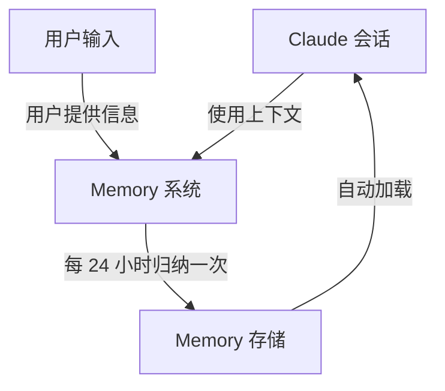
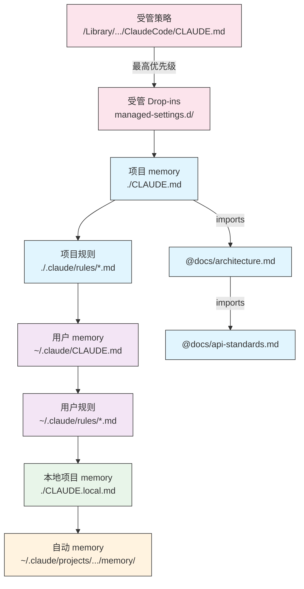
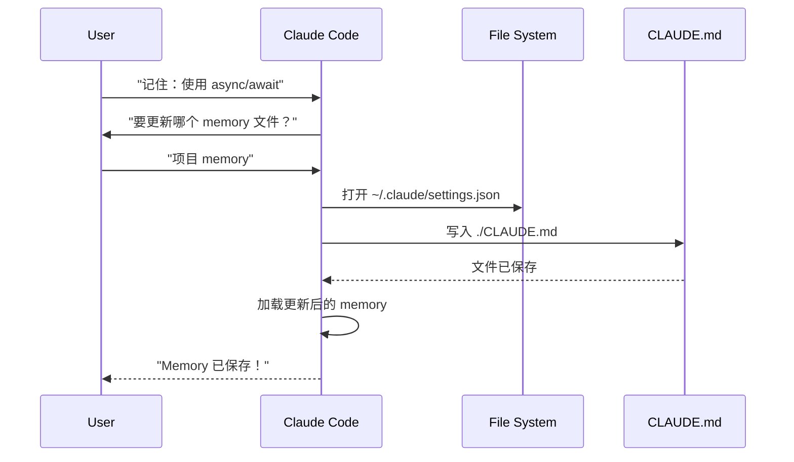
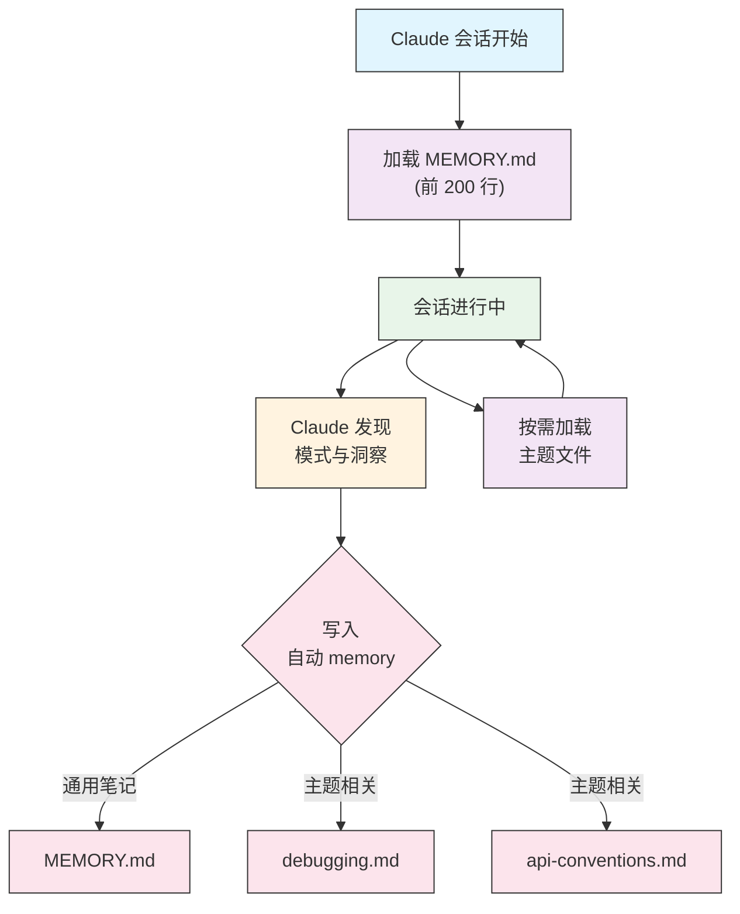

<picture>
  <source media="(prefers-color-scheme: dark)" srcset="../resources/logos/claude-howto-logo-dark.svg">
  
</picture>

# Memory 指南

Memory 让 Claude 在不同会话和对话之间保留上下文。它有两种形式：claude.ai 中的自动归纳，以及 Claude Code 中基于文件系统的 `CLAUDE.md`。

## 概览

Claude Code 中的 Memory 提供持久上下文，可以跨多个会话和对话延续。与临时上下文窗口不同，Memory 文件让你可以：

- 在团队之间共享项目规范
- 保存个人开发偏好
- 维护目录级规则和配置
- 导入外部文档
- 将 memory 作为项目的一部分纳入版本控制

Memory 系统是分层工作的，从全局个人偏好一直延伸到特定子目录，让你可以精细控制 Claude 记住什么，以及如何应用这些知识。

## Memory 命令速查

| 命令 | 作用 | 用法 | 适用场景 |
|---------|---------|-------|-------------|
| `/init` | 初始化项目 Memory | `/init` | 新项目开始时，首次创建 `CLAUDE.md` |
| `/memory` | 在编辑器中编辑 Memory 文件 | `/memory` | 大规模更新、重组、审阅内容 |
| `#` 前缀 | 快速添加单行 Memory | `# Your rule here` | 对话中快速添加规则 |
| `# new rule into memory` | 显式添加 Memory | `# new rule into memory<br/>Your detailed rule` | 添加复杂的多行规则 |
| `# remember this` | 自然语言 Memory | `# remember this<br/>Your instruction` | 用对话方式更新 Memory |
| `@path/to/file` | 导入外部内容 | `@README.md` 或 `@docs/api.md` | 在 `CLAUDE.md` 中引用现有文档 |

## 快速开始：初始化 Memory

### `/init` 命令

`/init` 是在 Claude Code 中设置项目 Memory 的最快方式。它会创建一个 `CLAUDE.md` 文件，作为项目基础文档。

**用法：**

```bash
/init
```

**它会做什么：**

- 在项目中创建一个新的 `CLAUDE.md` 文件（通常位于 `./CLAUDE.md` 或 `./.claude/CLAUDE.md`）
- 建立项目约定和指导原则
- 为跨会话的上下文持久化打下基础
- 提供一个模板结构，用于记录项目规范

**增强交互模式：** 设置 `CLAUDE_CODE_NEW_INIT=true` 可以启用一个多阶段交互流程，逐步引导你完成项目设置：

```bash
CLAUDE_CODE_NEW_INIT=true claude
/init
```

**什么时候使用 `/init`：**

- 使用 Claude Code 开始一个新项目时
- 建立团队编码标准和约定时
- 为代码库结构编写文档时
- 为协作开发设置 Memory 层级时

**示例流程：**

```markdown
# 在你的项目目录中
/init

# Claude 创建 CLAUDE.md，结构可能如下：
# 项目配置
## 项目概览
- 名称：你的项目
- 技术栈：[你的技术]
- 团队规模：[开发者人数]

## 开发标准
- 代码风格偏好
- 测试要求
- Git 工作流约定
```

### 用 `#` 快速更新 Memory

你可以在任何对话中，通过在消息开头加上 `#` 来快速向 Memory 添加信息：

**语法：**

```markdown
# 这里写你的 Memory 规则或说明
```

**示例：**

```markdown
# 本项目始终使用 TypeScript 严格模式

# 优先使用 async/await，而不是 promise 链

# 每次提交前都运行 npm test

# 文件名统一使用 kebab-case
```

**工作方式：**

1. 在消息开头输入 `#`，后面跟上你的规则
2. Claude 会识别这是一个 Memory 更新请求
3. Claude 会询问要更新哪个 Memory 文件（项目或个人）
4. 规则会被添加到对应的 `CLAUDE.md` 文件中
5. 未来的会话会自动加载这些上下文

**其他写法：**

```markdown
# new rule into memory
Always validate user input with Zod schemas

# remember this
Use semantic versioning for all releases

# add to memory
Database migrations must be reversible
```

### `/memory` 命令

`/memory` 让你可以直接在 Claude Code 会话里打开并编辑 `CLAUDE.md` Memory 文件。它会在系统编辑器中打开这些文件，便于完整修改。

**用法：**

```bash
/memory
```

**它会做什么：**

- 在系统默认编辑器中打开 Memory 文件
- 允许你进行大规模新增、修改和重组
- 可以直接访问层级中的所有 Memory 文件
- 让你管理跨会话的持久上下文

**什么时候使用 `/memory`：**

- 审阅现有 Memory 内容
- 大规模更新项目标准
- 重组 Memory 结构
- 添加详细文档或指南
- 随着项目演进维护和更新 Memory

**对比：`/memory` vs `/init`**

| 方面 | `/memory` | `/init` |
|--------|-----------|---------|
| **目的** | 编辑现有 memory 文件 | 初始化新的 `CLAUDE.md` |
| **适用时机** | 更新/修改项目上下文 | 开始新项目 |
| **动作** | 打开编辑器进行修改 | 生成起始模板 |
| **工作流** | 持续维护 | 一次性设置 |

**示例流程：**

```markdown
# 打开 Memory 进行编辑
/memory

# Claude 展示选项：
# 1. 受管策略 Memory
# 2. 项目 Memory (./CLAUDE.md)
# 3. 用户 Memory (~/.claude/CLAUDE.md)
# 4. 本地项目 Memory

# 选择选项 2（项目 Memory）
# 默认编辑器会打开 ./CLAUDE.md 的内容

# 修改、保存并关闭编辑器
# Claude 会自动重新加载更新后的 Memory
```

**使用 Memory 导入：**

`CLAUDE.md` 文件支持 `@path/to/file` 语法来包含外部内容：

```markdown
# 项目文档
查看 @README.md 了解项目概览
查看 @package.json 了解可用的 npm 命令
查看 @docs/architecture.md 了解系统设计

# 使用绝对路径从主目录导入
@~/.claude/my-project-instructions.md
```

**导入特性：**

- 支持相对路径和绝对路径（例如 `@docs/api.md` 或 `@~/.claude/my-project-instructions.md`）
- 支持递归导入，最大深度为 5
- 首次从外部位置导入会触发安全审批对话
- 导入指令不会在 markdown 代码片段或代码块中求值（因此在示例里写它们是安全的）
- 通过引用现有文档减少重复
- 会自动把引用内容包含进 Claude 的上下文

## Memory 架构

Claude Code 的 Memory 采用分层系统，不同范围承担不同职责：



## Claude Code 中的 Memory 层级

Claude Code 使用多层级的分层 Memory 系统。启动 Claude Code 时，Memory 文件会自动加载，更高优先级的文件会覆盖更低优先级的文件。

**完整 Memory 层级（按优先级顺序）：**

1. **受管策略（Managed Policy）** - 组织级指令
   - macOS：`/Library/Application Support/ClaudeCode/CLAUDE.md`
   - Linux/WSL：`/etc/claude-code/CLAUDE.md`
   - Windows：`C:\Program Files\ClaudeCode\CLAUDE.md`

2. **受管 Drop-ins（Managed Drop-ins）** - 按字母顺序合并的策略文件（v2.1.83+）
   - 位于受管策略 `CLAUDE.md` 同级的 `managed-settings.d/` 目录
   - 文件按字母顺序合并，便于模块化管理策略

3. **项目 Memory（Project Memory）** - 团队共享上下文（受版本控制）
   - `./.claude/CLAUDE.md` 或 `./CLAUDE.md`（仓库根目录）

4. **项目规则（Project Rules）** - 模块化、主题化的项目指令
   - `./.claude/rules/*.md`

5. **用户 Memory（User Memory）** - 个人偏好（所有项目）
   - `~/.claude/CLAUDE.md`

6. **用户级规则（User-Level Rules）** - 个人规则（所有项目）
   - `~/.claude/rules/*.md`

7. **本地项目 Memory（Local Project Memory）** - 个人项目特定偏好
   - `./CLAUDE.local.md`

> **注意**：截至 2026 年 3 月，`CLAUDE.local.md` 在[官方文档](https://code.claude.com/docs/en/memory)中尚未提及。它可能仍作为旧功能可用。对于新项目，建议改用 `~/.claude/CLAUDE.md`（用户级）或 `.claude/rules/`（项目级、按路径作用域）。

8. **自动 Memory（Auto Memory）** - Claude 自动记录的笔记和学习
   - `~/.claude/projects/<project>/memory/`

**Memory 发现行为：**

Claude 会按以下顺序查找 Memory 文件，越靠前的位置优先级越高：



## 使用 `claudeMdExcludes` 排除 `CLAUDE.md` 文件

在大型 monorepo 中，有些 `CLAUDE.md` 文件可能与当前工作无关。`claudeMdExcludes` 设置可以让你跳过特定的 `CLAUDE.md` 文件，使它们不会加载进上下文：

```jsonc
// 在 ~/.claude/settings.json 或 .claude/settings.json 中
{
  "claudeMdExcludes": [
    "packages/legacy-app/CLAUDE.md",
    "vendors/**/CLAUDE.md"
  ]
}
```

这些模式会针对相对于项目根目录的路径进行匹配。它尤其适用于：

- 有很多子项目的 monorepo，而当前只关心其中一部分
- 包含 vendor 或第三方 `CLAUDE.md` 文件的仓库
- 通过排除过时或无关的指令来减少 Claude 上下文窗口中的噪音

## 设置文件层级

Claude Code 的设置（包括 `autoMemoryDirectory`、`claudeMdExcludes` 以及其他配置）会从五层层级中解析，越高层级优先级越高：

| 层级 | 位置 | 作用范围 |
|-------|----------|-------|
| 1（最高） | 受管策略（系统级） | 组织级强制执行 |
| 2 | `managed-settings.d/`（v2.1.83+） | 模块化策略 drop-in，按字母顺序合并 |
| 3 | `~/.claude/settings.json` | 用户偏好 |
| 4 | `.claude/settings.json` | 项目级（提交到 git） |
| 5（最低） | `.claude/settings.local.json` | 本地覆盖（被 git 忽略） |

**平台特定配置（v2.1.51+）：**

设置也可以通过以下方式配置：
- **macOS**：属性列表（plist）文件
- **Windows**：Windows 注册表

这些平台原生机制会与 JSON 设置文件一起读取，并遵循相同的优先级规则。

## 模块化规则系统

使用 `.claude/rules/` 目录结构来创建有组织、按路径划分的规则。规则既可以定义在项目级，也可以定义在用户级：

```text
your-project/
├── .claude/
│   ├── CLAUDE.md
│   └── rules/
│       ├── code-style.md
│       ├── testing.md
│       ├── security.md
│       └── api/                  # 支持子目录
│           ├── conventions.md
│           └── validation.md

~/.claude/
├── CLAUDE.md
└── rules/                        # 用户级规则（所有项目）
    ├── personal-style.md
    └── preferred-patterns.md
```

`rules/` 目录会递归发现规则，包括任意子目录。`~/.claude/rules/` 下的用户级规则会先于项目级规则加载，因此个人默认值可以被项目覆盖。

### 使用 YAML Frontmatter 定义按路径生效的规则

定义只适用于特定文件路径的规则：

```markdown
---
paths: src/api/**/*.ts
---

# API 开发规则

- 所有 API 端点都必须包含输入校验
- 使用 Zod 进行 schema 校验
- 记录所有参数和响应类型
- 所有操作都要有错误处理
```

**Glob 模式示例：**

- `**/*.ts` - 所有 TypeScript 文件
- `src/**/*` - `src/` 下的所有文件
- `src/**/*.{ts,tsx}` - 多个扩展名
- `{src,lib}/**/*.ts, tests/**/*.test.ts` - 多个模式

### 子目录与符号链接

`.claude/rules/` 中的规则支持两种组织特性：

- **子目录**：规则会递归发现，因此你可以按主题把它们组织到文件夹中（例如 `rules/api/`、`rules/testing/`、`rules/security/`）
- **符号链接**：支持通过符号链接在多个项目之间共享规则。例如，你可以从中心位置把一个共享规则文件符号链接到每个项目的 `.claude/rules/` 目录中

## Memory 位置表

| 位置 | 作用范围 | 优先级 | 是否共享 | 访问方式 | 最适合 |
|----------|-------|----------|--------|--------|----------|
| `/Library/Application Support/ClaudeCode/CLAUDE.md`（macOS） | 受管策略 | 1（最高） | 组织 | 系统 | 公司级策略 |
| `/etc/claude-code/CLAUDE.md`（Linux/WSL） | 受管策略 | 1（最高） | 组织 | 系统 | 组织标准 |
| `C:\Program Files\ClaudeCode\CLAUDE.md`（Windows） | 受管策略 | 1（最高） | 组织 | 系统 | 企业指导 |
| `managed-settings.d/*.md`（与策略文件同级） | 受管 Drop-ins | 1.5 | 组织 | 系统 | 模块化策略文件（v2.1.83+） |
| `./CLAUDE.md` 或 `./.claude/CLAUDE.md` | 项目 memory | 2 | 团队 | Git | 团队标准、共享架构 |
| `./.claude/rules/*.md` | 项目规则 | 3 | 团队 | Git | 按路径划分的模块化规则 |
| `~/.claude/CLAUDE.md` | 用户 memory | 4 | 个人 | 文件系统 | 个人偏好（所有项目） |
| `~/.claude/rules/*.md` | 用户规则 | 5 | 个人 | 文件系统 | 个人规则（所有项目） |
| `./CLAUDE.local.md` | 本地项目 | 6 | 个人 | Git（忽略） | 个人项目特定偏好 |
| `~/.claude/projects/<project>/memory/` | 自动 memory | 7（最低） | 个人 | 文件系统 | Claude 自动记录的笔记和学习 |

## Memory 更新生命周期

下面是 memory 更新在 Claude Code 会话中如何流转的：



## 自动 Memory

自动 memory 是一个持久化目录，Claude 会在和你的项目协作时自动记录学习内容、模式和洞察。与需要你手动编写和维护的 `CLAUDE.md` 文件不同，自动 memory 由 Claude 在会话期间自行写入。

### 自动 Memory 如何工作

- **位置**：`~/.claude/projects/<project>/memory/`
- **入口文件**：`MEMORY.md` 是自动 memory 目录中的主文件
- **主题文件**：用于特定主题的可选附加文件（例如 `debugging.md`、`api-conventions.md`）
- **加载行为**：`MEMORY.md` 的前 200 行会在会话开始时加载到系统提示中。主题文件按需加载，不会在启动时就读取。
- **读写**：Claude 会在会话中随着发现模式和项目特定知识而读写 memory 文件

### 自动 Memory 架构



### 自动 Memory 目录结构

```text
~/.claude/projects/<project>/memory/
├── MEMORY.md              # 入口文件（启动时加载前 200 行）
├── debugging.md           # 主题文件（按需加载）
├── api-conventions.md     # 主题文件（按需加载）
└── testing-patterns.md    # 主题文件（按需加载）
```

### 版本要求

自动 memory 需要 **Claude Code v2.1.59 或更高版本**。如果你使用的是更旧的版本，请先升级：

```bash
npm install -g @anthropic-ai/claude-code@latest
```

### 自定义自动 Memory 目录

默认情况下，自动 memory 存储在 `~/.claude/projects/<project>/memory/`。你可以使用 `autoMemoryDirectory` 设置更改这个位置（自 **v2.1.74** 起可用）：

```jsonc
// 在 ~/.claude/settings.json 或 .claude/settings.local.json 中（仅用户/本地设置）
{
  "autoMemoryDirectory": "/path/to/custom/memory/directory"
}
```

> **注意**：`autoMemoryDirectory` 只能在用户级（`~/.claude/settings.json`）或本地设置（`.claude/settings.local.json`）中配置，不能在项目或受管策略设置中配置。

这在以下场景很有用：

- 将自动 memory 存放在共享或同步的位置
- 将自动 memory 与默认 Claude 配置目录分开
- 使用默认层级之外的项目特定路径

### Worktree 和仓库共享

同一个 git 仓库中的所有 worktree 和子目录都会共享一个自动 memory 目录。这意味着在不同 worktree 之间切换，或者在同一仓库的不同子目录中工作，读写的都会是同一组 memory 文件。

### 子代理 Memory

子代理（通过 Task 或并行执行等工具启动）可以有自己的 memory 上下文。你可以在子代理定义中使用 `memory` frontmatter 字段，指定要加载哪些 memory 范围：

```yaml
memory: user      # 只加载用户级 memory
memory: project   # 只加载项目级 memory
memory: local     # 只加载本地 memory
```

这样子代理就能使用聚焦上下文，而不是继承完整的 memory 层级。

### 控制自动 Memory

可以通过 `CLAUDE_CODE_DISABLE_AUTO_MEMORY` 环境变量控制自动 memory：

| 值 | 行为 |
|-------|-------|
| `0` | 强制开启自动 memory |
| `1` | 强制关闭自动 memory |
| *(未设置)* | 默认行为（启用自动 memory） |

```bash
# 为当前会话禁用自动 memory
CLAUDE_CODE_DISABLE_AUTO_MEMORY=1 claude

# 显式强制开启自动 memory
CLAUDE_CODE_DISABLE_AUTO_MEMORY=0 claude
```

## 使用 `--add-dir` 添加额外目录

`--add-dir` 参数允许 Claude Code 加载当前工作目录之外的其他目录中的 `CLAUDE.md` 文件。这对于 monorepo 或多项目场景尤其有用，因为其他目录中的上下文也可能相关。

要启用此功能，先设置环境变量：

```bash
CLAUDE_CODE_ADDITIONAL_DIRECTORIES_CLAUDE_MD=1
```

然后使用该参数启动 Claude Code：

```bash
claude --add-dir /path/to/other/project
```

Claude 会把指定额外目录中的 `CLAUDE.md` 和当前工作目录里的 memory 一起加载。

## 实用示例

### 示例 1：项目 Memory 结构

**文件：** `./CLAUDE.md`

```markdown
# 项目配置

## 项目概览
- **名称**：电商平台
- **技术栈**：Node.js、PostgreSQL、React 18、Docker
- **团队规模**：5 名开发者
- **截止日期**：2025 年第 4 季度

## 架构
@docs/architecture.md
@docs/api-standards.md
@docs/database-schema.md

## 开发标准

### 代码风格
- 使用 Prettier 格式化
- 使用带 airbnb 配置的 ESLint
- 最大行长：100 个字符
- 使用 2 空格缩进

### 命名约定
- **文件**：kebab-case（user-controller.js）
- **类**：PascalCase（UserService）
- **函数/变量**：camelCase（getUserById）
- **常量**：UPPER_SNAKE_CASE（API_BASE_URL）
- **数据库表**：snake_case（user_accounts）

### Git 工作流
- 分支名：`feature/description` 或 `fix/description`
- 提交信息：遵循 conventional commits
- 合并前必须有 PR
- 所有 CI/CD 检查都必须通过
- 至少需要 1 个审批

### 测试要求
- 最低 80% 代码覆盖率
- 所有关键路径都必须有测试
- 单元测试使用 Jest
- E2E 测试使用 Cypress
- 测试文件名：`*.test.ts` 或 `*.spec.ts`

### API 标准
- 仅使用 RESTful 端点
- 请求/响应使用 JSON
- 正确使用 HTTP 状态码
- API 版本化：`/api/v1/`
- 为所有端点编写示例文档

### 数据库
- schema 变更使用迁移
- 不要硬编码凭据
- 使用连接池
- 开发环境开启查询日志
- 需要定期备份

### 部署
- 使用 Docker 部署
- 使用 Kubernetes 编排
- 蓝绿部署策略
- 失败时自动回滚
- 部署前先运行数据库迁移

## 常用命令

| 命令 | 作用 |
|---------|---------|
| `npm run dev` | 启动开发服务器 |
| `npm test` | 运行测试套件 |
| `npm run lint` | 检查代码风格 |
| `npm run build` | 构建生产版本 |
| `npm run migrate` | 运行数据库迁移 |

## 团队联系人
- 技术负责人：Sarah Chen (@sarah.chen)
- 产品经理：Mike Johnson (@mike.j)
- DevOps：Alex Kim (@alex.k)

## 已知问题与解决办法
- PostgreSQL 连接池在高峰时段限制为 20
- 解决办法：实现查询排队
- Safari 14 与 async generator 存在兼容性问题
- 解决办法：使用 Babel 转译器

## 相关项目
- 分析看板：`/projects/analytics`
- 移动端 App：`/projects/mobile`
- 管理后台：`/projects/admin`
```

### 示例 2：目录级 Memory

**文件：** `./src/api/CLAUDE.md`

```markdown
# API 模块标准

这个文件会覆盖 /src/api/ 下所有内容对应的根目录 CLAUDE.md

## API 特定标准

### 请求校验
- 使用 Zod 进行 schema 校验
- 始终校验输入
- 校验失败返回 400
- 包含字段级错误详情

### 认证
- 所有端点都需要 JWT token
- token 放在 Authorization header 中
- token 24 小时后过期
### 刷新 token 机制
- 实现 refresh token 机制

### 响应格式

所有响应都必须遵循以下结构：

```json
{
  "success": true,
  "data": { /* 实际数据 */ },
  "timestamp": "2025-11-06T10:30:00Z",
  "version": "1.0"
}
```

错误响应：
```json
{
  "success": false,
  "error": {
    "code": "VALIDATION_ERROR",
    "message": "用户提示信息",
    "details": { /* 字段错误 */ }
  },
  "timestamp": "2025-11-06T10:30:00Z"
}
```

#### 分页

- 使用基于 cursor 的分页（不要用 offset）
- 包含 `hasMore` 布尔值
- 最大 page size 限制为 100
- 默认 page size：20

#### 限流

- 认证用户每小时 1000 次请求
- 公共端点每小时 100 次请求
- 超限返回 429
- 包含 retry-after header

#### 缓存

- 使用 Redis 做会话缓存
- 默认缓存时长：5 分钟
- 写操作后失效缓存
- 缓存 key 按资源类型打标签

### 示例 3：个人 Memory

```
**文件：** `~/.claude/CLAUDE.md`

```markdown
# 我的开发偏好

## 关于我
- **经验水平**：8 年全栈开发
- **偏好语言**：TypeScript、Python
- **沟通风格**：直接，带示例
- **学习方式**：配合代码的可视化图示

## 代码偏好

### 错误处理
我更喜欢显式错误处理，使用 try-catch 和有意义的错误信息。
避免泛化错误。始终记录错误，便于调试。

### 注释
注释应该写 WHY，不是 WHAT。代码本身应当可以自解释。
注释应解释业务逻辑或不明显的决策。

### 测试
我倾向于 TDD（测试驱动开发）。
先写测试，再写实现。
关注行为，而不是实现细节。

### 架构
我更喜欢模块化、低耦合的设计。
为了可测试性使用依赖注入。
分离职责（Controllers、Services、Repositories）。

## 调试偏好
- 使用带前缀的 console.log：`[DEBUG]`
- 包含上下文：函数名、相关变量
- 可用时使用堆栈追踪
- 日志中始终包含时间戳

## 沟通
- 用图示解释复杂概念
- 先给具体示例，再解释理论
- 包含修改前/后的代码片段
- 在末尾总结关键点

## 项目组织
我通常这样组织项目：

   project/
   ├── src/
   │   ├── api/
   │   ├── services/
   │   ├── models/
   │   └── utils/
   ├── tests/
   ├── docs/
   └── docker/

## 工具链
- **IDE**：VS Code，带 vim 快捷键
- **终端**：Zsh + Oh-My-Zsh
- **格式化**：Prettier（100 字符行长）
- **Lint**：带 airbnb 配置的 ESLint
- **测试框架**：Jest + React Testing Library
```

_我的测试_
让 Claude 保存一条新规则


Claude 没有保存该规则，因为我当前没有任何 `Claude.md` 文件。随后我让 Claude 确认保存位置。


### 示例 4：会话中的 Memory 更新

你可以在活跃的 Claude Code 会话中向 memory 添加新规则。有两种方式：

#### 方式 1：直接请求

```markdown
User: 记住，我在所有新组件里更喜欢用 React hooks，而不是 class components。

Claude: 我正在把这条规则加进你的 memory。应该写到哪个 memory 文件？
        1. 项目 memory (./CLAUDE.md)
        2. 个人 memory (~/.claude/CLAUDE.md)

User: 项目 memory

Claude: ✅ Memory 已保存！

已添加到 ./CLAUDE.md：
---

### 组件开发
- 使用函数式组件和 React Hooks
- 优先使用 hooks 而不是 class components
- 用 custom hooks 复用逻辑
- 事件处理器使用 useCallback
- 昂贵计算使用 useMemo
```

#### 方式 2：使用 `# new rule into memory` 模式

你也可以使用明确的 `# new rule into memory` 模式来触发 memory 更新：

```markdown
User: # new rule into memory
      在处理之前，始终使用 Zod schemas 校验用户输入。

Claude: 我正在把这条规则保存到 memory。应该使用哪个 memory 文件？
        1. 项目 memory (./CLAUDE.md)
        2. 个人 memory (~/.claude/CLAUDE.md)

User: 项目 memory

Claude: ✅ Memory 已保存！

已添加到 ./CLAUDE.md：
---

### 输入校验
- 在处理之前始终使用 Zod schemas 校验用户输入
- 在每个 API handler 文件顶部定义 schemas
- 校验失败时返回 400 状态码
```

#### 添加 Memory 的建议

- 规则要具体且可执行
- 将相关规则归到同一个 section 标题下
- 用更新已有 section 的方式替代重复添加内容
- 选择合适的 memory 作用范围（项目 vs 个人）

## Memory 功能对比

| 功能 | Claude Web/Desktop | Claude Code（CLAUDE.md） |
|---------|-------------------|------------------------|
| 自动归纳 | ✅ 每 24 小时 | ❌ 手动 |
| 跨项目 | ✅ 共享 | ❌ 仅项目内 |
| 团队访问 | ✅ 共享项目 | ✅ Git 跟踪 |
| 可搜索 | ✅ 内置 | ✅ 通过 `/memory` |
| 可编辑 | ✅ 聊天中编辑 | ✅ 直接编辑文件 |
| 导入/导出 | ✅ 支持 | ✅ 复制/粘贴 |
| 持久性 | ✅ 24 小时以上 | ✅ 无限期 |

### Claude Web/Desktop 中的 Memory

#### Memory 归纳时间线


**示例 Memory 摘要：**

```markdown
## Claude 对用户的记忆

### 专业背景
- 资深全栈开发者，拥有 8 年经验
- 专注 TypeScript/Node.js 后端和 React 前端
- 活跃的开源贡献者
- 对 AI 和机器学习感兴趣

### 项目上下文
- 当前正在构建电商平台
- 技术栈：Node.js、PostgreSQL、React 18、Docker
- 与 5 人团队协作
- 使用 CI/CD 和蓝绿部署

### 沟通偏好
- 喜欢直接、简洁的说明
- 喜欢图示和示例
- 重视代码片段
- 会在注释中解释业务逻辑

### 当前目标
- 提升 API 性能
- 将测试覆盖率提升到 90%
- 实现缓存策略
- 记录架构文档
```

## 最佳实践

### 应该做的

- **要具体且详细**：使用清晰、详细的说明，而不是模糊的指导
  - ✅ 好：`所有 JavaScript 文件都使用 2 空格缩进`
  - ❌ 避免：`遵循最佳实践`

- **保持结构清晰**：使用明确的 markdown section 和标题组织 memory 文件

- **使用合适的层级**：
  - **受管策略**：公司级策略、安全标准、合规要求
  - **项目 memory**：团队标准、架构、编码约定（提交到 git）
  - **用户 memory**：个人偏好、沟通风格、工具选择
  - **目录 memory**：模块级规则和覆盖

- **善用导入**：使用 `@path/to/file` 语法引用现有文档
  - 支持最多 5 层递归嵌套
  - 避免在多个 memory 文件里重复内容
  - 例如：`See @README.md for project overview`

- **记录常用命令**：把经常使用的命令写进去，节省时间

- **对项目 memory 进行版本控制**：把项目级 `CLAUDE.md` 提交到 git，方便团队共享

- **定期审阅**：随着项目演进和需求变化，定期更新 memory

- **提供具体示例**：包含代码片段和具体场景

### 不应该做的

- **不要存放密钥**：绝不要包含 API keys、密码、token 或凭据

- **不要包含敏感数据**：不要有 PII、私人信息或专有机密

- **不要重复内容**：用导入（`@path`）引用现有文档即可

- **不要写得太笼统**：避免像“遵循最佳实践”或“写好代码”这样的通用表述

- **不要过长**：单个 memory 文件保持聚焦，控制在 500 行以内

- **不要过度组织**：分层要有策略，不要创建过多的子目录覆盖

- **不要忘记更新**：过时的 memory 会导致混乱和旧实践

- **不要超过嵌套限制**：memory 导入最多支持 5 层嵌套

### Memory 管理建议

**选择正确的 memory 层级：**

| 使用场景 | Memory 层级 | 原因 |
|----------|-------------|-----------|
| 公司安全策略 | 受管策略 | 适用于整个组织的所有项目 |
| 团队代码风格指南 | 项目 | 通过 git 与团队共享 |
| 你偏好的编辑器快捷键 | 用户 | 个人偏好，不共享 |
| API 模块标准 | 目录 | 只适用于该模块 |

**快速更新工作流：**

1. 单条规则：在对话中使用 `#` 前缀
2. 多项修改：使用 `/memory` 打开编辑器
3. 初始设置：使用 `/init` 创建模板

**导入最佳实践：**

```markdown
# Good: 引用现有文档
@README.md
@docs/architecture.md
@package.json

# Avoid: 复制其他地方已经存在的内容
# 不要把 README 的内容复制进 CLAUDE.md，而是直接导入它
```

## 安装说明

### 设置项目 Memory

#### 方法 1：使用 `/init` 命令（推荐）

设置项目 memory 的最快方式：

1. **进入你的项目目录：**
   ```bash
   cd /path/to/your/project
   ```

2. **在 Claude Code 中运行 init 命令：**
   ```bash
   /init
   ```

3. **Claude 会创建并填充 `CLAUDE.md`**，带有一个模板结构

4. **自定义生成的文件**，让它符合你的项目需求

5. **提交到 git：**
   ```bash
   git add CLAUDE.md
   git commit -m "Initialize project memory with /init"
   ```

#### 方法 2：手动创建

如果你更喜欢手动设置：

1. **在项目根目录创建 `CLAUDE.md`：**
   ```bash
   cd /path/to/your/project
   touch CLAUDE.md
   ```

2. **添加项目标准：**
   ```bash
   cat > CLAUDE.md << 'EOF'
   # Project Configuration

   ## Project Overview
   - **Name**: Your Project Name
   - **Tech Stack**: List your technologies
   - **Team Size**: Number of developers

   ## Development Standards
   - Your coding standards
   - Naming conventions
   - Testing requirements
   EOF
   ```

3. **提交到 git：**
   ```bash
   git add CLAUDE.md
   git commit -m "Add project memory configuration"
   ```

#### 方法 3：用 `#` 进行快速更新

一旦 `CLAUDE.md` 存在，就可以在对话中快速添加规则：

```markdown
# 所有发布都使用语义化版本

# 提交前始终运行测试

# 优先组合而不是继承
```

Claude 会提示你选择要更新哪个 memory 文件。

### 设置个人 Memory

1. **创建 `~/.claude` 目录：**
   ```bash
   mkdir -p ~/.claude
   ```

2. **创建个人 `CLAUDE.md`：**
   ```bash
   touch ~/.claude/CLAUDE.md
   ```

3. **添加你的偏好：**
   ```bash
   cat > ~/.claude/CLAUDE.md << 'EOF'
   # My Development Preferences

   ## About Me
   - Experience Level: [Your level]
   - Preferred Languages: [Your languages]
   - Communication Style: [Your style]

   ## Code Preferences
   - [Your preferences]
   EOF
   ```

### 设置目录级 Memory

1. **为特定目录创建 memory：**
   ```bash
   mkdir -p /path/to/directory/.claude
   touch /path/to/directory/CLAUDE.md
   ```

2. **添加目录特定规则：**
   ```bash
   cat > /path/to/directory/CLAUDE.md << 'EOF'
   # [Directory Name] Standards

   This file overrides root CLAUDE.md for this directory.

   ## [Specific Standards]
   EOF
   ```

3. **提交到版本控制：**
   ```bash
   git add /path/to/directory/CLAUDE.md
   git commit -m "Add [directory] memory configuration"
   ```

### 验证设置

1. **检查 memory 位置：**
   ```bash
   # 项目根目录 memory
   ls -la ./CLAUDE.md

   # 个人 memory
   ls -la ~/.claude/CLAUDE.md
   ```

2. **Claude Code 会在启动会话时自动加载**这些文件

3. **在你的项目中启动新的 Claude Code 会话进行测试**

## 官方文档

如需最新信息，请参考 Claude Code 官方文档：

- **[Memory 文档](https://code.claude.com/docs/en/memory)** - 完整的 memory 系统参考
- **[Slash Commands 参考](https://code.claude.com/docs/en/interactive-mode)** - 所有内置命令，包括 `/init` 和 `/memory`
- **[CLI 参考](https://code.claude.com/docs/en/cli-reference)** - 命令行接口文档

### 官方文档中的关键技术细节

**Memory 加载：**

- Claude Code 启动时会自动加载所有 memory 文件
- Claude 会从当前工作目录向上遍历，查找 `CLAUDE.md` 文件
- 当访问某个子树目录时，会按上下文发现并加载其文件

**导入语法：**

- 使用 `@path/to/file` 包含外部内容（例如 `@~/.claude/my-project-instructions.md`）
- 支持相对路径和绝对路径
- 支持最多 5 层递归导入
- 首次导入外部内容会触发审批对话
- 不会在 markdown 代码片段或代码块中求值
- 会自动把引用内容包含到 Claude 的上下文中

**Memory 层级优先级：**

1. 受管策略（最高优先级）
2. 受管 Drop-ins（`managed-settings.d/`，v2.1.83+）
3. 项目 memory
4. 项目规则（`.claude/rules/`）
5. 用户 memory
6. 用户级规则（`~/.claude/rules/`）
7. 本地项目 memory
8. 自动 memory（最低优先级）

## 相关概念链接

### 集成点
- [MCP 协议](../05-mcp/) - 与 memory 一起访问实时数据
- [Slash Commands](../01-slash-commands/) - 会话级快捷方式
- [Skills](../03-skills/) - 带 memory 上下文的自动化工作流

### 相关 Claude 功能
- [Claude Web Memory](https://claude.ai) - 自动归纳
- [官方 Memory 文档](https://code.claude.com/docs/en/memory) - Anthropic 文档
