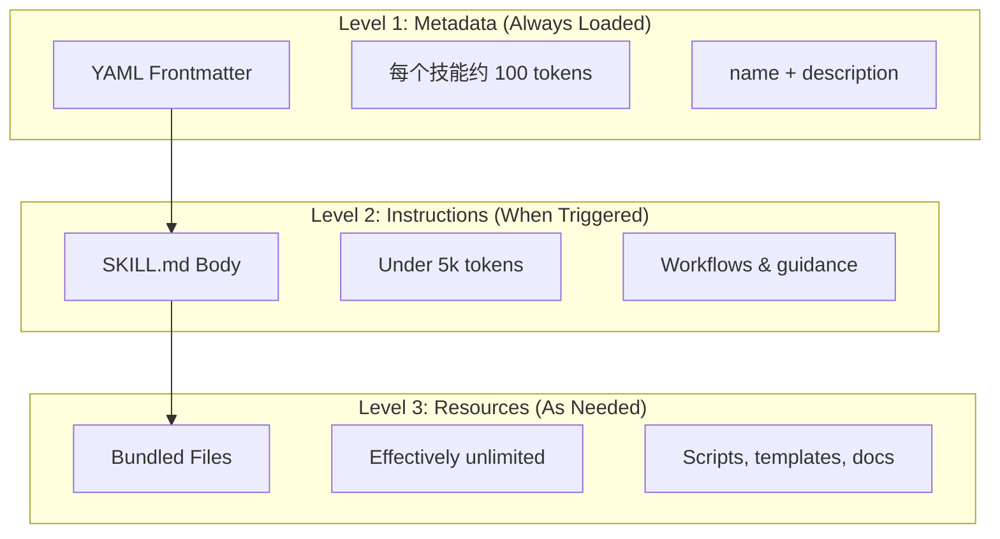
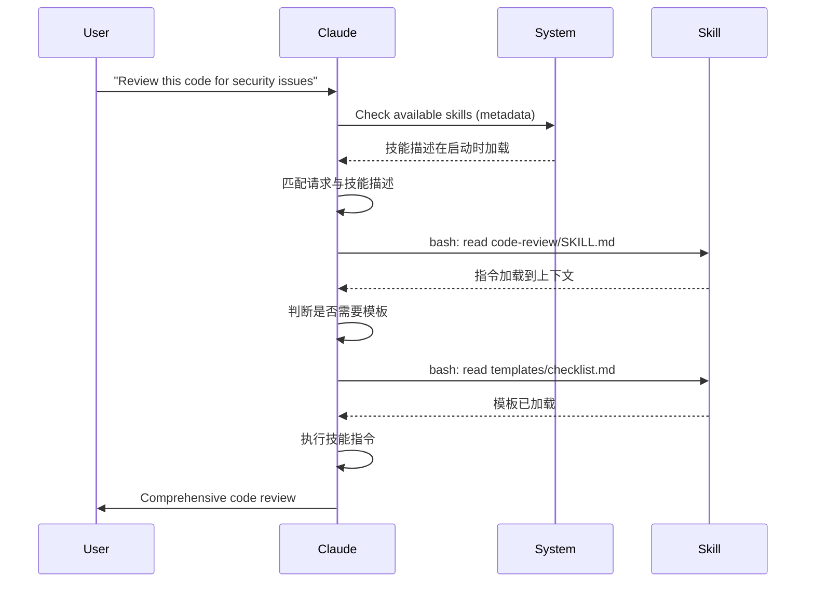

<picture>
  <source media="(prefers-color-scheme: dark)" srcset="../resources/logos/claude-howto-logo-dark.svg">
  
</picture>

# Agent Skills 指南

Agent Skills 是可复用的、基于文件系统的能力，用来扩展 Claude 的功能。它们将特定领域的专业知识、工作流和最佳实践封装成可发现的组件，Claude 会在相关时自动使用。

## 概览

**Agent Skills** 是模块化能力，可将通用代理转变为专家型代理。与提示词（用于一次性任务、处于会话层级的指令）不同，Skills 会按需加载，不必在多次对话中反复提供相同指导。

### 核心优势

- **让 Claude 专业化**：为特定领域任务定制能力
- **减少重复劳动**：创建一次，在多个对话中自动使用
- **组合能力**：将多个技能组合成复杂工作流
- **扩展工作流**：在多个项目和团队之间复用技能
- **保持质量**：将最佳实践直接嵌入工作流

Skills 遵循 [Agent Skills](https://agentskills.io) 开放标准，该标准可跨多种 AI 工具使用。Claude Code 在此标准之上扩展了更多功能，例如调用控制、子代理执行和动态上下文注入。

> **注意**：自定义斜杠命令已经并入 Skills。`.claude/commands/` 下的文件仍然可用，并支持相同的 frontmatter 字段。对于新开发，推荐使用 Skills。当两者在同一路径同时存在时（例如 `.claude/commands/review.md` 和 `.claude/skills/review/SKILL.md`），技能的优先级更高。

## Skills 如何工作：渐进式披露

Skills 利用一种**渐进式披露**架构。Claude 会按需分阶段加载信息，而不是一开始就消耗所有上下文。这使得上下文管理更高效，同时保持几乎无限的可扩展性。

### 三个加载层级



| 层级 | 加载时机 | Token 成本 | 内容 |
|-------|------------|------------|---------|
| **Level 1: Metadata** | 始终（启动时） | 每个技能约 100 tokens | YAML frontmatter 中的 `name` 和 `description` |
| **Level 2: Instructions** | 技能被触发时 | 低于 5k tokens | `SKILL.md` 正文中的指令和指导 |
| **Level 3+: Resources** | 按需 | 实际上无限制 | 通过 bash 执行的打包文件，其内容不会预先加载进上下文 |

这意味着你可以安装很多 Skills 而不会带来上下文惩罚。Claude 只会先知道每个 Skill 的存在以及何时使用它，直到真正触发时才进一步加载。

## 技能加载流程



## 技能类型与位置

| 类型 | 位置 | 作用范围 | 是否共享 | 最适合 |
|------|----------|-------|--------|----------|
| **Enterprise** | 受管设置 | 组织内所有用户 | 是 | 组织级统一标准 |
| **Personal** | `~/.claude/skills/<skill-name>/SKILL.md` | 个人 | 否 | 个人工作流 |
| **Project** | `.claude/skills/<skill-name>/SKILL.md` | 团队 | 是（通过 git） | 团队标准 |
| **Plugin** | `<plugin>/skills/<skill-name>/SKILL.md` | 在启用处可用 | 视情况而定 | 与插件一同分发 |

当不同层级存在同名技能时，优先级更高的位置获胜：**enterprise > personal > project**。插件技能使用 `plugin-name:skill-name` 命名空间，因此不会发生冲突。

### 自动发现

**嵌套目录**：当你在子目录中的文件上工作时，Claude Code 会自动发现嵌套 `.claude/skills/` 目录中的 Skills。比如，如果你正在编辑 `packages/frontend/` 中的文件，Claude Code 也会查找 `packages/frontend/.claude/skills/` 下的 Skills。这支持 monorepo 场景，让不同 package 拥有各自的 Skills。

**`--add-dir` 目录**：通过 `--add-dir` 添加的目录中的技能会被自动加载，并支持实时变更检测。对这些目录中技能文件的任何编辑都会立即生效，无需重启 Claude Code。

**描述预算**：技能描述（Level 1 元数据）上限为**上下文窗口的 2%**（回退值为 **16,000 个字符**）。如果你安装了很多技能，部分技能可能会被排除。运行 `/context` 查看警告。你也可以通过 `SLASH_COMMAND_TOOL_CHAR_BUDGET` 环境变量覆盖此预算。

## 创建自定义技能

### 基本目录结构

```
my-skill/
├── SKILL.md           # 主说明文件（必需）
├── template.md        # 供 Claude 填充的模板
├── examples/
│   └── sample.md      # 展示期望格式的示例输出
└── scripts/
    └── validate.sh    # Claude 可执行的脚本
```

### SKILL.md 格式

```yaml
---
name: your-skill-name
description: Brief description of what this skill does and when to use it
---

# Your Skill Name

## Instructions
Provide clear, step-by-step guidance for Claude.

## Examples
Show concrete examples of using this skill.
```

### 必填字段

- **name**：只能使用小写字母、数字和连字符（最多 64 个字符）。不能包含 `"anthropic"` 或 `"claude"`。
- **description**：说明这个技能做什么，以及何时使用它（最多 1024 个字符）。这对 Claude 判断何时激活该技能至关重要。

### 可选 Frontmatter 字段

```yaml
---
name: my-skill
description: What this skill does and when to use it
argument-hint: "[filename] [format]"        # 自动补全提示
disable-model-invocation: true              # 仅用户可调用
user-invocable: false                       # 从斜杠菜单中隐藏
allowed-tools: Read, Grep, Glob             # 限制可访问工具
model: opus                                 # 指定要使用的模型
effort: high                                # 覆盖 effort 等级（low, medium, high, max）
context: fork                               # 在隔离的子代理中运行
agent: Explore                              # 使用哪种代理类型（配合 context: fork）
shell: bash                                 # 命令使用的 shell：bash（默认）或 powershell
hooks:                                      # skill 作用域内的 hooks
  PreToolUse:
    - matcher: "Bash"
      hooks:
        - type: command
          command: "./scripts/validate.sh"
---
```

| 字段 | 说明 |
|-------|-------------|
| `name` | 只能使用小写字母、数字和连字符（最多 64 个字符）。不能包含 `"anthropic"` 或 `"claude"`。 |
| `description` | 说明这个技能做什么，以及何时使用它（最多 1024 个字符）。这是自动调用匹配的关键。 |
| `argument-hint` | 在 `/` 自动补全菜单中显示的提示（例如 `"[filename] [format]"`）。 |
| `disable-model-invocation` | `true` = 只有用户能通过 `/name` 调用。Claude 永远不会自动调用。 |
| `user-invocable` | `false` = 在 `/` 菜单中隐藏。只能由 Claude 自动调用。 |
| `allowed-tools` | 此技能在无需权限提示的情况下可使用的工具列表，用逗号分隔。 |
| `model` | 技能生效期间使用的模型覆盖项（例如 `opus`、`sonnet`）。 |
| `effort` | 技能生效期间的 effort 覆盖项：`low`、`medium`、`high` 或 `max`。 |
| `context` | `fork` 表示在分叉出来的子代理上下文中运行该技能，并拥有独立上下文窗口。 |
| `agent` | 当 `context: fork` 时使用的子代理类型（例如 `Explore`、`Plan`、`general-purpose`）。 |
| `shell` | `!`command`` 替换和脚本所使用的 shell：`bash`（默认）或 `powershell`。 |
| `hooks` | 绑定在该技能生命周期上的 hooks（格式与全局 hooks 相同）。 |

## 技能内容类型

Skills 可以包含两种内容类型，各自适用于不同用途：

### 参考型内容

为 Claude 当前工作增加知识，例如约定、模式、风格指南和领域知识。它会直接在当前会话上下文中内联运行。

```yaml
---
name: api-conventions
description: API design patterns for this codebase
---

When writing API endpoints:
- Use RESTful naming conventions
- Return consistent error formats
- Include request validation
```

### 任务型内容

针对特定动作给出分步说明。通常会直接通过 `/skill-name` 调用。

```yaml
---
name: deploy
description: Deploy the application to production
context: fork
disable-model-invocation: true
---

Deploy the application:
1. Run the test suite
2. Build the application
3. Push to the deployment target
```

## 控制 Skill 调用方式

默认情况下，你和 Claude 都可以调用任意技能。两个 frontmatter 字段控制三种调用模式：

| Frontmatter | 你可以调用 | Claude 可以调用 |
|---|---|---|
| （默认） | 是 | 是 |
| `disable-model-invocation: true` | 是 | 否 |
| `user-invocable: false` | 否 | 是 |

**对有副作用的工作流使用 `disable-model-invocation: true`**，例如 `/commit`、`/deploy`、`/send-slack-message`。你不会希望 Claude 因为“代码看起来准备好了”就自行决定去部署。

**对不能作为命令执行的后台知识使用 `user-invocable: false`**。例如一个 `legacy-system-context` 技能用来解释旧系统如何运作，这对 Claude 有帮助，但对用户而言并不是一个有意义的动作。

## 字符串替换

Skills 支持在内容到达 Claude 之前解析的动态值：

| 变量 | 说明 |
|----------|-------------|
| `$ARGUMENTS` | 调用技能时传入的全部参数 |
| `$ARGUMENTS[N]` 或 `$N` | 按索引访问特定参数（从 0 开始） |
| `${CLAUDE_SESSION_ID}` | 当前会话 ID |
| `${CLAUDE_SKILL_DIR}` | 包含该技能的 `SKILL.md` 文件的目录 |
| `` !`command` `` | 动态上下文注入，执行 shell 命令并将输出内联插入 |

**示例：**

```yaml
---
name: fix-issue
description: Fix a GitHub issue
---

Fix GitHub issue $ARGUMENTS following our coding standards.
1. Read the issue description
2. Implement the fix
3. Write tests
4. Create a commit
```

运行 `/fix-issue 123` 时，`$ARGUMENTS` 会被替换为 `123`。

## 注入动态上下文

`!`command`` 语法会在技能内容发送给 Claude 之前执行 shell 命令：

```yaml
---
name: pr-summary
description: Summarize changes in a pull request
context: fork
agent: Explore
---

## Pull request context
- PR diff: !`gh pr diff`
- PR comments: !`gh pr view --comments`
- Changed files: !`gh pr diff --name-only`

## Your task
Summarize this pull request...
```

命令会立即执行；Claude 只会看到最终输出。默认情况下，命令在 `bash` 中运行。若要改用 PowerShell，请在 frontmatter 中设置 `shell: powershell`。

## 在子代理中运行 Skills

添加 `context: fork` 即可让 Skill 在隔离的子代理上下文中运行。Skill 内容会成为专用子代理的任务，该子代理拥有自己的上下文窗口，从而让主会话保持整洁。

`agent` 字段用于指定要使用的代理类型：

| 代理类型 | 最适合 |
|---|---|
| `Explore` | 只读研究、代码库分析 |
| `Plan` | 制定实现计划 |
| `general-purpose` | 需要使用所有工具的广泛任务 |
| 自定义代理 | 你在配置中定义的专用代理 |

**frontmatter 示例：**

```yaml
---
context: fork
agent: Explore
---
```

**完整 Skill 示例：**

```yaml
---
name: deep-research
description: Research a topic thoroughly
context: fork
agent: Explore
---

Research $ARGUMENTS thoroughly:
1. Find relevant files using Glob and Grep
2. Read and analyze the code
3. Summarize findings with specific file references
```

## 实用示例

### 示例 1：代码审查技能

**目录结构：**

```
~/.claude/skills/code-review/
├── SKILL.md
├── templates/
│   ├── review-checklist.md
│   └── finding-template.md
└── scripts/
    ├── analyze-metrics.py
    └── compare-complexity.py
```

**文件：** `~/.claude/skills/code-review/SKILL.md`

```yaml
---
name: code-review-specialist
description: Comprehensive code review with security, performance, and quality analysis. Use when users ask to review code, analyze code quality, evaluate pull requests, or mention code review, security analysis, or performance optimization.
---

# Code Review Skill

这个示例技能提供全面的代码审查能力，重点关注：

1. **Security Analysis**
   - Authentication/authorization issues
   - Data exposure risks
   - Injection vulnerabilities
   - Cryptographic weaknesses

2. **Performance Review**
   - Algorithm efficiency (Big O analysis)
   - Memory optimization
   - Database query optimization
   - Caching opportunities

3. **Code Quality**
   - SOLID principles
   - Design patterns
   - Naming conventions
   - Test coverage

4. **Maintainability**
   - Code readability
   - Function size (should be < 50 lines)
   - Cyclomatic complexity
   - Type safety

## Review Template

For each piece of code reviewed, provide:

### Summary
- Overall quality assessment (1-5)
- Key findings count
- Recommended priority areas

### Critical Issues (if any)
- **Issue**: Clear description
- **Location**: File and line number
- **Impact**: Why this matters
- **Severity**: Critical/High/Medium
- **Fix**: Code example

For detailed checklists, see [templates/review-checklist.md](templates/review-checklist.md).
```

### 示例 2：代码库可视化技能

一个可生成交互式 HTML 可视化的技能：

**目录结构：**

```
~/.claude/skills/codebase-visualizer/
├── SKILL.md
└── scripts/
    └── visualize.py
```

**文件：** `~/.claude/skills/codebase-visualizer/SKILL.md`

```yaml
---
name: codebase-visualizer
description: Generate an interactive collapsible tree visualization of your codebase. Use when exploring a new repo, understanding project structure, or identifying large files.
allowed-tools: Bash(python *)
---

# Codebase Visualizer

Generate an interactive HTML tree view showing your project's file structure.

## Usage

Run the visualization script from your project root:

```bash
python ~/.claude/skills/codebase-visualizer/scripts/visualize.py .
```

This creates `codebase-map.html` and opens it in your default browser.

## What the visualization shows

- **Collapsible directories**: Click folders to expand/collapse
- **File sizes**: Displayed next to each file
- **Colors**: Different colors for different file types
- **Directory totals**: Shows aggregate size of each folder
```

打包的 Python 脚本负责完成大量实际工作，而 Claude 则负责整体编排。

### 示例 3：部署 Skill（仅用户调用）

```yaml
---
name: deploy
description: Deploy the application to production
disable-model-invocation: true
allowed-tools: Bash(npm *), Bash(git *)
---

Deploy $ARGUMENTS to production:

1. Run the test suite: `npm test`
2. Build the application: `npm run build`
3. Push to the deployment target
4. Verify the deployment succeeded
5. Report deployment status
```

### 示例 4：品牌语气 Skill（后台知识）

```yaml
---
name: brand-voice
description: Ensure all communication matches brand voice and tone guidelines. Use when creating marketing copy, customer communications, or public-facing content.
user-invocable: false
---

## Tone of Voice
- **Friendly but professional** - approachable without being casual
- **Clear and concise** - avoid jargon
- **Confident** - we know what we're doing
- **Empathetic** - understand user needs

## Writing Guidelines
- Use "you" when addressing readers
- Use active voice
- Keep sentences under 20 words
- Start with value proposition

For templates, see [templates/](templates/).
```

### 示例 5：CLAUDE.md 生成器 Skill

```yaml
---
name: claude-md
description: Create or update CLAUDE.md files following best practices for optimal AI agent onboarding. Use when users mention CLAUDE.md, project documentation, or AI onboarding.
---

## Core Principles

**LLMs are stateless**: CLAUDE.md is the only file automatically included in every conversation.

### The Golden Rules

1. **Less is More**: Keep under 300 lines (ideally under 100)
2. **Universal Applicability**: Only include information relevant to EVERY session
3. **Don't Use Claude as a Linter**: Use deterministic tools instead
4. **Never Auto-Generate**: Craft it manually with careful consideration

## Essential Sections

- **Project Name**: Brief one-line description
- **Tech Stack**: Primary language, frameworks, database
- **Development Commands**: Install, test, build commands
- **Critical Conventions**: Only non-obvious, high-impact conventions
- **Known Issues / Gotchas**: Things that trip up developers
```

### 示例 6：带脚本的重构 Skill

**目录结构：**

```
refactor/
├── SKILL.md
├── references/
│   ├── code-smells.md
│   └── refactoring-catalog.md
├── templates/
│   └── refactoring-plan.md
└── scripts/
    ├── analyze-complexity.py
    └── detect-smells.py
```

**文件：** `refactor/SKILL.md`

```yaml
---
name: code-refactor
description: 基于 Martin Fowler 方法论的系统化代码重构。适用于用户请求重构代码、改进代码结构、减少技术债或消除代码异味时使用。
---

# Code Refactoring Skill

A phased approach emphasizing safe, incremental changes backed by tests.

## Workflow

Phase 1: Research & Analysis → Phase 2: Test Coverage Assessment →
Phase 3: Code Smell Identification → Phase 4: Refactoring Plan Creation →
Phase 5: Incremental Implementation → Phase 6: Review & Iteration

## Core Principles

1. **Behavior Preservation**: External behavior must remain unchanged
2. **Small Steps**: Make tiny, testable changes
3. **Test-Driven**: Tests are the safety net
4. **Continuous**: Refactoring is ongoing, not a one-time event

如需查看代码异味目录，请参见 [references/code-smells.md](references/code-smells.md)。
For refactoring techniques, see [references/refactoring-catalog.md](references/refactoring-catalog.md).
```

## 支持文件

除了 `SKILL.md` 之外，Skills 还可以在其目录中包含多个文件。这些支持文件（模板、示例、脚本、参考文档）可以让主技能文件保持聚焦，同时在 Claude 需要时提供额外资源。

```
my-skill/
├── SKILL.md              # 主说明文件（必需，保持在 500 行以内）
├── templates/            # 供 Claude 填写的模板
│   └── output-format.md
├── examples/             # 展示期望格式的示例输出
│   └── sample-output.md
├── references/           # 领域知识与规范
│   └── api-spec.md
└── scripts/              # Claude 可执行的脚本
    └── validate.sh
```

支持文件的指导原则：

- 将 `SKILL.md` 保持在 **500 行以内**。把详细参考资料、大型示例和规格说明移到单独文件中。
- 在 `SKILL.md` 中使用**相对路径**引用附加文件（例如 `[API 参考](references/api-spec.md)`）。
- 支持文件在 Level 3 才会加载（按需），因此在 Claude 真正读取它们之前不会消耗上下文。

## 管理 Skills

### 查看可用 Skills

直接问 Claude：
```
What Skills are available?
```

或者检查文件系统：
```bash
# 列出个人 Skills
ls ~/.claude/skills/

# 列出项目 Skills
ls .claude/skills/
```

### 测试一个 Skill

有两种测试方式：

**让 Claude 自动调用它**，方法是提出一个与描述匹配的问题：
```
Can you help me review this code for security issues?
```

**或者直接调用它**，使用 Skill 名称：
```
/code-review src/auth/login.ts
```

### 更新一个 Skill

直接编辑 `SKILL.md` 文件。变更会在 Claude Code 下一次启动时生效。

```bash
# Personal Skill
code ~/.claude/skills/my-skill/SKILL.md

# Project Skill
code .claude/skills/my-skill/SKILL.md
```

### 限制 Claude 对技能的访问

有三种方式可以控制 Claude 能调用哪些技能：

**在 `/permissions` 中禁用所有技能**：
```
# 添加到 deny 规则：
Skill
```

**允许或拒绝特定技能**：
```
# 只允许特定技能
Skill(commit)
Skill(review-pr *)

# 拒绝特定技能
Skill(deploy *)
```

**隐藏单个技能**，方法是在其 frontmatter 中加入 `disable-model-invocation: true`。

## 最佳实践

### 1. 让描述足够具体

- **差（模糊）**："Helps with documents"
- **好（具体）**："Extract text and tables from PDF files, fill forms, merge documents. Use when working with PDF files or when the user mentions PDFs, forms, or document extraction."

### 2. 保持技能聚焦

- 一个技能 = 一种能力
- ✅ "PDF form filling"
- ❌ "Document processing"（过于宽泛）

### 3. 包含触发词

在描述中加入能匹配用户请求的关键词：
```yaml
description: Analyze Excel spreadsheets, generate pivot tables, create charts. Use when working with Excel files, spreadsheets, or .xlsx files.
```

### 4. 保持 SKILL.md 在 500 行以内

将详细参考资料移到单独文件，Claude 需要时再加载。

### 5. 引用支持文件

```markdown
## Additional resources

- For complete API details, see [reference.md](reference.md)
- For usage examples, see [examples.md](examples.md)
```

### 应该做的

- 使用清晰、描述性强的名称
- 提供完整的操作说明
- 添加具体示例
- 打包相关脚本和模板
- 用真实场景测试
- 记录依赖项

### 不应该做的

- 不要为一次性任务创建技能
- 不要重复已有功能
- 不要让技能过于宽泛
- 不要跳过 `description` 字段
- 不要在未审计的情况下安装来自不可信来源的技能

## 故障排查

### 快速参考

| 问题 | 解决方案 |
|-------|----------|
| Claude 不使用技能 | 让描述更具体，并加入触发词 |
| 找不到技能文件 | 验证路径：`~/.claude/skills/name/SKILL.md` |
| YAML 错误 | 检查 `---` 标记、缩进，并确保没有 tab |
| Skills 冲突 | 在描述中使用不同的触发词 |
| 脚本无法运行 | 检查权限：`chmod +x scripts/*.py` |
| Claude 看不到全部 Skills | Skills 太多；检查 `/context` 中的警告 |

### 技能未触发

如果 Claude 没有在预期情况下使用你的技能：

1. 检查描述中是否包含用户自然会说出的关键词
2. 确认在询问 “What skills are available?” 时该技能会显示出来
3. 尝试重新措辞你的请求，使之更贴近描述
4. 直接使用 `/skill-name` 调用以测试

### 技能触发过于频繁

如果 Claude 在你不希望的情况下使用了你的技能：

1. 让描述更具体
2. 添加 `disable-model-invocation: true`，改为仅手动调用

### Claude 看不到全部技能

技能描述会按**上下文窗口的 2%**加载（回退值为 **16,000 个字符**）。运行 `/context` 查看是否有技能被排除的警告。你也可以通过 `SLASH_COMMAND_TOOL_CHAR_BUDGET` 环境变量覆盖该预算。

## 安全注意事项

**只使用来自可信来源的 Skills。** Skills 会通过说明和代码赋予 Claude 能力，而恶意技能可能会诱导 Claude 调用工具或执行有害代码。

**关键安全考虑：**

- **彻底审计**：检查技能目录中的所有文件
- **外部来源有风险**：会从外部 URL 获取内容的 Skills 可能被篡改
- **工具滥用**：恶意 Skills 可以以有害方式调用工具
- **将其视为安装软件**：只使用来自可信来源的 Skills

## Skills 与其他功能的区别

| 功能 | 调用方式 | 最适合 |
|---------|------------|----------|
| **Skills** | 自动或 `/name` | 可复用的专业能力与工作流 |
| **Slash Commands** | 用户主动 `/name` | 快捷操作（现已并入 Skills） |
| **Subagents** | 自动委派 | 隔离式任务执行 |
| **Memory (CLAUDE.md)** | 始终加载 | 持久项目上下文 |
| **MCP** | 实时 | 外部数据/服务访问 |
| **Hooks** | 事件驱动 | 自动副作用执行 |

## 内置 Skills

Claude Code 自带若干内置 Skills，无需安装即可始终使用：

| Skill | 说明 |
|-------|-------------|
| `/simplify` | 审查已更改文件的复用性、质量和效率；会并行启动 3 个审查代理 |
| `/batch <instruction>` | 使用 git worktrees 在整个代码库中编排大规模并行修改 |
| `/debug [description]` | 通过读取调试日志来排查当前会话问题 |
| `/loop [interval] <prompt>` | 按固定间隔重复运行提示词（例如 `/loop 5m check the deploy`） |
| `/claude-api` | 加载 Claude API/SDK 参考；在导入 `anthropic`/`@anthropic-ai/sdk` 时自动激活 |

这些 Skills 开箱即用，无需安装或配置。它们与自定义 Skills 使用相同的 `SKILL.md` 格式。

## 分享 Skills

### 项目 Skills（团队共享）

1. 在 `.claude/skills/` 中创建技能
2. 提交到 git
3. 团队成员拉取变更后，Skills 立即可用

### 个人 Skills

```bash
# 复制到个人目录
cp -r my-skill ~/.claude/skills/

# 让脚本可执行
chmod +x ~/.claude/skills/my-skill/scripts/*.py
```

### 插件分发

将 Skills 打包到插件的 `skills/` 目录中，以便更广泛地分发。

## 更进一步：技能集合与技能管理器

一旦你开始认真构建 Skills，就会发现有两样东西变得非常重要：一套经过验证的技能库，以及一个管理这些技能的工具。

**[luongnv89/skills](https://github.com/luongnv89/skills)**：这是我几乎在所有项目中每天都会使用的一组 Skills。亮点包括 `logo-designer`（即时生成项目 logo）和 `ollama-optimizer`（为你的硬件调优本地 LLM 性能）。如果你想要开箱即用的 Skills，这是个很好的起点。

**[luongnv89/asm](https://github.com/luongnv89/asm)**：Agent Skill Manager。它负责技能开发、重复检测和测试。`asm link` 命令允许你在任意项目中测试一个技能，而不必来回复制文件；当你的 Skills 不止少数几个时，这会变得非常关键。

## 更多资源

- [官方 Skills 文档](https://code.claude.com/docs/en/skills)
- [Agent Skills 架构博客](https://claude.com/blog/equipping-agents-for-the-real-world-with-agent-skills)
- [Skills 仓库](https://github.com/luongnv89/skills) - 开箱即用的 skills 集合
- [Slash Commands 指南](../01-slash-commands/) - 用户主动触发的快捷方式
- [Subagents 指南](../04-subagents/) - 委派式 AI 代理
- [Memory 指南](../02-memory/) - 持久上下文
- [MCP（Model Context Protocol）](../05-mcp/) - 实时外部数据
- [Hooks 指南](../06-hooks/) - 事件驱动自动化
