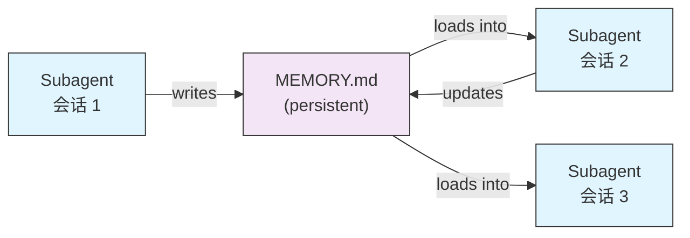
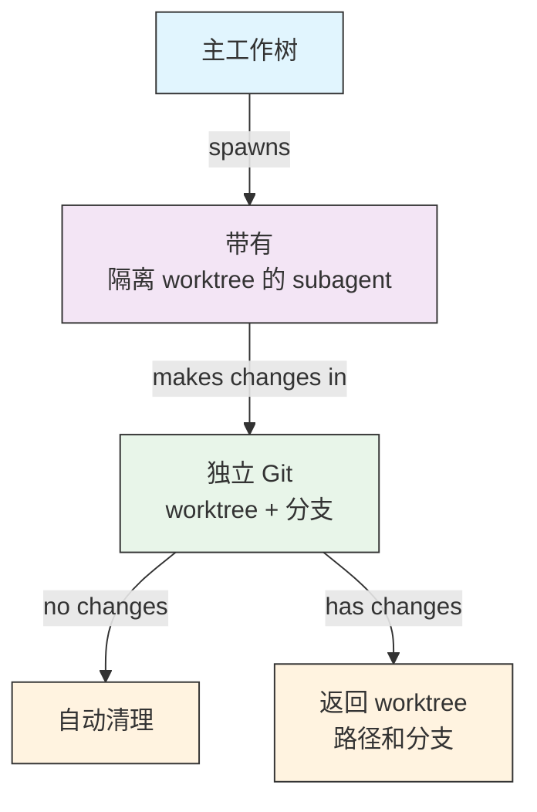
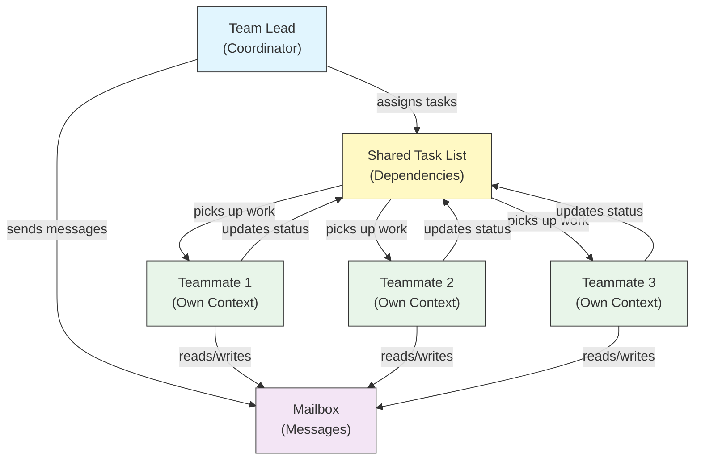
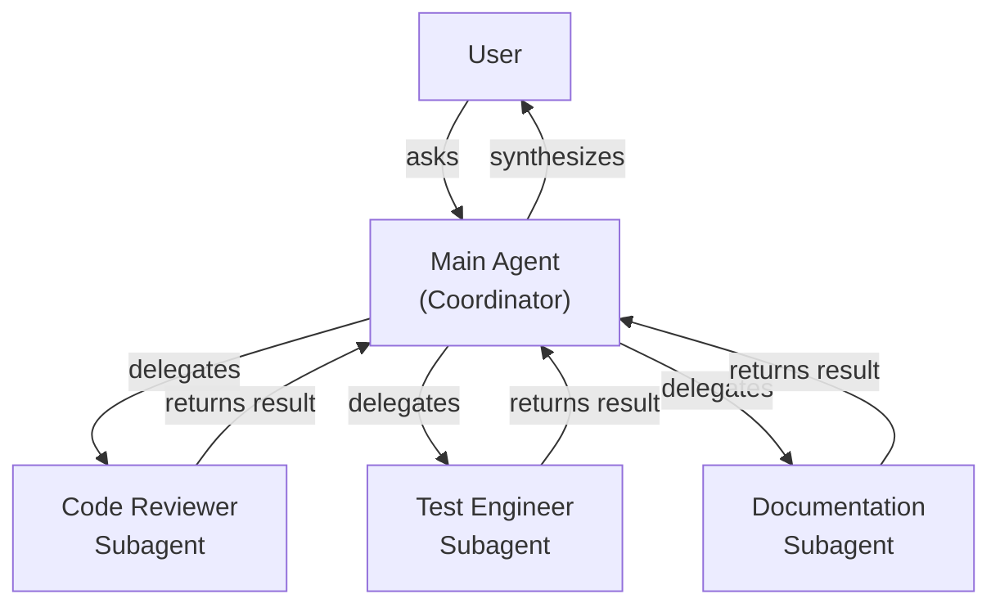
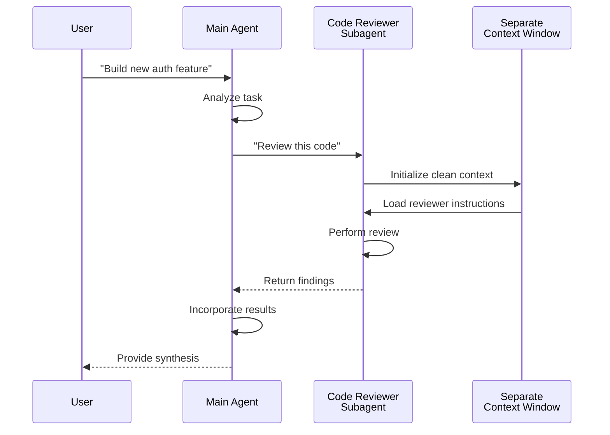
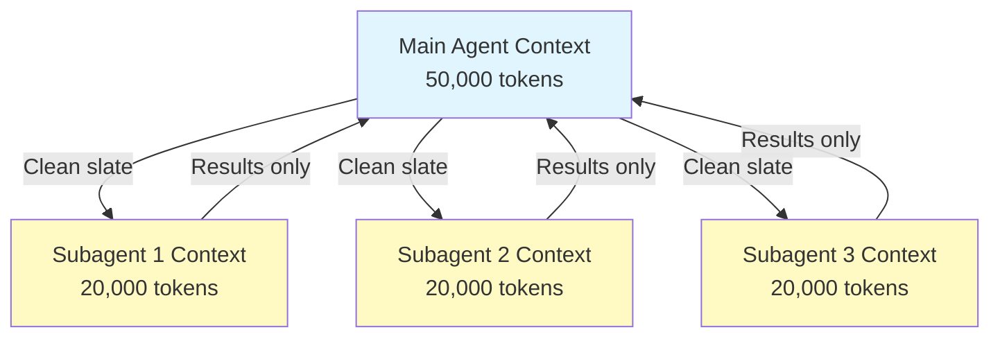
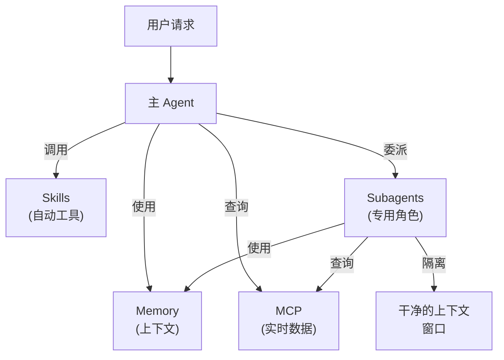

<picture>
  <source media="(prefers-color-scheme: dark)" srcset="../resources/logos/claude-howto-logo-dark.svg">
  
</picture>

# Subagents - 完整参考指南

子代理是 Claude Code 可以委派任务的专用 AI 助手。每个子代理都有明确用途，使用独立于主会话的上下文窗口，并且可以配置特定工具和自定义系统提示词。

## 目录

1. [概览](#概览)
2. [核心优势](#核心优势)
3. [文件位置](#文件位置)
4. [配置](#配置)
5. [内置 Subagents](#内置-subagents)
6. [管理 Subagents](#管理-subagents)
7. [使用 Subagents](#使用-subagents)
8. [可恢复的 Agents](#可恢复的-agents)
9. [串联 Subagents](#串联-subagents)
10. [Subagents 的持久记忆](#subagents-的持久记忆)
11. [后台 Subagents](#后台-subagents)
12. [Worktree 隔离](#worktree-隔离)
13. [限制可启动的 Subagents](#限制可启动的-subagents)
14. [`claude agents` CLI 命令](#claude-agents-cli-命令)
15. [Agent Teams（实验性）](#agent-teams实验性)
16. [插件 Subagent 安全](#插件-subagent-安全)
17. [架构](#架构)
18. [上下文管理](#上下文管理)
19. [什么时候使用 Subagents](#什么时候使用-subagents)
20. [最佳实践](#最佳实践)
21. [本目录中的示例 Subagents](#本目录中的示例-subagents)
22. [安装说明](#安装说明)
23. [相关概念](#相关概念)

---

## 概览

子代理通过以下方式，让 Claude Code 可以委派执行任务：

- 创建具有独立上下文窗口的**隔离 AI 助手**
- 为特定专业能力提供**定制系统提示词**
- 通过**工具访问控制**限制可用能力
- 避免复杂任务造成**上下文污染**
- 支持多个专门任务的**并行执行**

每个子代理都像从零开始一样独立运行，只接收完成任务所需的相关上下文，然后把结果返回给主代理进行综合。

**快速开始**：使用 `/agents` 命令可以交互式创建、查看、编辑和管理你的子代理。

---

## 核心优势

| 优势 | 说明 |
|---------|-------------|
| **保留上下文** | 在独立上下文中运行，避免污染主会话 |
| **专业化能力** | 针对特定领域进行优化，成功率更高 |
| **可复用性** | 可跨项目使用，也可与团队共享 |
| **灵活权限** | 不同子代理类型可以拥有不同的工具访问级别 |
| **可扩展性** | 多个代理 可以同时处理不同方面的工作 |

---

## 文件位置

子代理文件可以存放在多个位置，并且拥有不同作用范围：

| 优先级 | 类型 | 位置 | 作用范围 |
|----------|------|----------|-------|
| 1（最高） | **CLI 定义** | 通过 `--agents` 参数（JSON） | 仅当前会话 |
| 2 | **项目子代理** | `.claude/agents/` | 当前项目 |
| 3 | **用户子代理** | `~/.claude/agents/` | 所有项目 |
| 4（最低） | **插件 agents** | 插件的 `agents/` 目录 | 通过插件提供 |

当存在同名定义时，优先级更高的来源会覆盖低优先级来源。

---

## 配置

### 文件格式

子代理使用 YAML frontmatter 定义，后面跟着 markdown 格式的系统提示词：

```yaml
---
name: your-sub-agent-name
description: Description of when this subagent should be invoked
tools: tool1, tool2, tool3  # 可选 - 如果省略则继承所有工具
disallowedTools: tool4  # 可选 - 明确禁止使用的工具
model: sonnet  # 可选 - sonnet、opus、haiku 或 inherit
permissionMode: default  # 可选 - 权限模式
maxTurns: 20  # 可选 - 限制 agentic 回合数
skills: skill1, skill2  # 可选 - 预加载到上下文的 skills
mcpServers: server1  # 可选 - 让 subagent 可用的 MCP 服务器
memory: user  # 可选 - 持久记忆作用范围（user、project、local）
background: false  # 可选 - 作为后台任务运行
effort: high  # 可选 - 推理 effort（low、medium、high、max）
isolation: worktree  # 可选 - git worktree 隔离
initialPrompt: "Start by analyzing the codebase"  # 可选 - 自动提交的第一轮内容
hooks:  # 可选 - 组件作用域 hooks
  PreToolUse:
    - matcher: "Bash"
      hooks:
        - type: command
          command: "./scripts/security-check.sh"
---

你的 subagent 系统提示词写在这里。它可以由多个段落组成，
并且应该清晰定义 subagent 的角色、能力以及解决问题的方式。
```

### 配置字段

| 字段 | 必填 | 说明 |
|-------|----------|-------------|
| `name` | 是 | 唯一标识符（小写字母和连字符） |
| `description` | 是 | 用自然语言描述用途。包含 `use PROACTIVELY` 可以鼓励自动调用 |
| `tools` | 否 | 以逗号分隔的具体工具列表。不填则继承所有工具。支持 `Agent(agent_name)` 语法来限制可启动的子代理 |
| `disallowedTools` | 否 | 子代理不能使用的工具列表，逗号分隔 |
| `model` | 否 | 要使用的模型：`sonnet`、`opus`、`haiku`、完整模型 ID 或 `inherit`。默认使用已配置的子代理模型 |
| `permissionMode` | 否 | `default`、`acceptEdits`、`dontAsk`、`bypassPermissions`、`plan` |
| `maxTurns` | 否 | 子代理可以执行的最大 agentic 回合数 |
| `skills` | 否 | 要预加载的 skills 列表。启动时会把完整 skill 内容注入子代理上下文 |
| `mcpServers` | 否 | 提供给子代理使用的 MCP 服务器 |
| `hooks` | 否 | 组件作用域 hooks（PreToolUse、PostToolUse、Stop） |
| `memory` | 否 | 持久记忆目录作用范围：`user`、`project` 或 `local` |
| `background` | 否 | 设为 `true` 时，始终把该子代理作为后台任务运行 |
| `effort` | 否 | 推理 effort 等级：`low`、`medium`、`high` 或 `max` |
| `isolation` | 否 | 设为 `worktree` 时，给子代理分配独立的 git worktree |
| `initialPrompt` | 否 | 当子代理作为主代理运行时，自动提交的首轮内容 |

### 工具配置选项

**选项 1：继承所有工具（省略该字段）**
```yaml
---
name: full-access-agent
description: Agent with all available tools
---
```

**选项 2：指定单个工具**
```yaml
---
name: limited-agent
description: 只允许使用特定工具的 agent
tools: Read, Grep, Glob, Bash
---
```

**选项 3：条件式工具访问**
```yaml
---
name: conditional-agent
description: 带过滤工具访问的 agent
tools: Read, Bash(npm:*), Bash(test:*)
---
```

### 基于 CLI 的配置

你可以使用 `--agents` 参数和 JSON 格式，为单个会话定义子代理：

```bash
claude --agents '{
  "code-reviewer": {
    "description": "Expert code reviewer. Use proactively after code changes.",
    "prompt": "You are a senior code reviewer. Focus on code quality, security, and best practices.",
    "tools": ["Read", "Grep", "Glob", "Bash"],
    "model": "sonnet"
  }
}'
```

**`--agents` 参数的 JSON 格式：**

```json
{
  "agent-name": {
    "description": "Required: when to invoke this agent",
    "prompt": "Required: system prompt for the agent",
    "tools": ["Optional", "array", "of", "tools"],
    "model": "optional: sonnet|opus|haiku"
  }
}
```

**Agent 定义的优先级：**

Agent 定义会按以下优先级加载（先匹配者生效）：
1. **CLI 定义** - `--agents` 参数（仅当前会话，JSON）
2. **项目级** - `.claude/agents/`（当前项目）
3. **用户级** - `~/.claude/agents/`（所有项目）
4. **插件级** - 插件的 `agents/` 目录

这样就可以让 CLI 定义在单个会话里覆盖所有其他来源。

---

## 内置 Subagents

Claude Code 包含若干始终可用的内置子代理：

| Agent | Model | 用途 |
|-------|-------|---------|
| **general-purpose** | Inherits | 复杂、多步骤任务 |
| **Plan** | Inherits | plan mode 下用于研究 |
| **Explore** | Haiku | 只读代码库探索（快速/中等/非常彻底） |
| **Bash** | Inherits | 在独立上下文中执行终端命令 |
| **statusline-setup** | Sonnet | 配置状态栏 |
| **Claude Code Guide** | Haiku | 回答 Claude Code 功能相关问题 |

### 通用 Subagent

| 属性 | 值 |
|----------|-------|
| **Model** | 继承自父级 |
| **Tools** | 所有工具 |
| **Purpose** | 复杂研究任务、多步骤操作、代码修改 |

**何时使用**：需要同时进行探索与修改，并且推理过程较复杂的任务。

### Plan Subagent

| 属性 | 值 |
|----------|-------|
| **Model** | 继承自父级 |
| **Tools** | Read、Glob、Grep、Bash |
| **Purpose** | 在 plan mode 中自动用于研究代码库 |

**何时使用**：在 Claude 提出计划之前，需要先理解代码库时。

### Explore Subagent

| 属性 | 值 |
|----------|-------|
| **Model** | Haiku（快速、低延迟） |
| **Mode** | 严格只读 |
| **Tools** | Glob、Grep、Read、Bash（仅只读命令） |
| **Purpose** | 快速搜索和分析代码库 |

**何时使用**：需要搜索或理解代码，但不进行修改时。

**彻底程度级别** - 指定探索深度：
- **"quick"** - 以最少探索进行快速搜索，适合查找特定模式
- **"medium"** - 中等探索，速度与彻底性平衡，默认方式
- **"very thorough"** - 对多个位置和命名约定进行全面分析，可能更耗时

### Bash Subagent

| 属性 | 值 |
|----------|-------|
| **Model** | 继承自父级 |
| **Tools** | Bash |
| **Purpose** | 在独立上下文窗口中执行终端命令 |

**何时使用**：运行 shell 命令且希望拥有隔离上下文时。

### Statusline Setup Subagent

| 属性 | 值 |
|----------|-------|
| **Model** | Sonnet |
| **Tools** | Read、Write、Bash |
| **Purpose** | 配置 Claude Code 的状态栏显示 |

**何时使用**：设置或自定义状态栏时。

### Claude Code Guide Subagent

| 属性 | 值 |
|----------|-------|
| **Model** | Haiku（快速、低延迟） |
| **Tools** | 只读 |
| **Purpose** | 回答关于 Claude Code 功能和用法的问题 |

**何时使用**：用户询问 Claude Code 如何工作，或如何使用特定功能时。

---

## 管理 Subagents

### 使用 `/agents` 命令（推荐）

```bash
/agents
```

这会提供一个交互菜单，用于：
- 查看所有可用子代理（内置、用户级和项目级）
- 按引导流程创建新的子代理
- 编辑已有的自定义子代理和工具访问权限
- 删除自定义子代理
- 在存在重名时查看哪些子代理处于激活状态

### 直接管理文件

```bash
# 创建项目 subagent
mkdir -p .claude/agents
cat > .claude/agents/test-runner.md << 'EOF'
---
name: test-runner
description: Use proactively to run tests and fix failures
---

You are a test automation expert. When you see code changes, proactively
run the appropriate tests. If tests fail, analyze the failures and fix
them while preserving the original test intent.
EOF

# 创建用户 subagent（在所有项目中可用）
mkdir -p ~/.claude/agents
```

---

## 使用 Subagents

### 自动委派

Claude 会基于以下内容主动委派任务：
- 你请求中的任务描述
- 子代理配置中的 `description` 字段
- 当前上下文和可用工具

如果想鼓励主动使用，请在 `description` 字段中加入 `use PROACTIVELY` 或 `MUST BE USED`：

```yaml
---
name: code-reviewer
description: Expert code review specialist. Use PROACTIVELY after writing or modifying code.
---
```

### 显式调用

你可以明确要求使用某个特定子代理：

```
> Use the test-runner subagent to fix failing tests
> Have the code-reviewer subagent look at my recent changes
> Ask the debugger subagent to investigate this error
```

### `@` 提及调用

使用 `@` 前缀可以确保调用指定子代理（会绕过自动委派启发式判断）：

```
> @"code-reviewer (agent)" review the auth module
```

### 会话范围内的 Agent

你可以在整个会话中，把某个特定 agent 作为主代理运行：

```bash
# 通过 CLI 参数
claude --agent code-reviewer

# 通过 settings.json
{
  "agent": "code-reviewer"
}
```

### 列出可用 Agents

使用 `claude agents` 命令列出所有来源中的已配置 agents：

```bash
claude agents
```

---

## 可恢复的 Agents

子代理可以继续之前的对话，并保留完整上下文：

```bash
# 初始调用
> Use the code-analyzer agent to start reviewing the authentication module
# 返回 agentId: "abc123"

# 稍后恢复该 agent
> Resume agent abc123 and now analyze the authorization logic as well
```

**适用场景**：
- 跨多个会话的长时间研究
- 不丢失上下文的迭代优化
- 需要保留上下文的多步骤工作流

---

## 串联 Subagents

按顺序执行多个子代理：

```bash
> First use the code-analyzer subagent to find performance issues,
  then use the optimizer subagent to fix them
```

这使得一个子代理的输出可以作为另一个子代理的输入，从而支持复杂工作流。

---

## Subagents 的持久记忆

`memory` 字段为子代理提供一个可跨会话保留的持久目录。这使得子代理能够随着时间积累知识，保存笔记、发现和上下文，并在会话之间持续存在。

### 记忆作用范围

| 作用范围 | 目录 | 使用场景 |
|-------|-----------|----------|
| `user` | `~/.claude/agent-memory/<name>/` | 跨所有项目的个人笔记和偏好 |
| `project` | `.claude/agent-memory/<name>/` | 与团队共享的项目专属知识 |
| `local` | `.claude/agent-memory-local/<name>/` | 不提交到版本控制的本地项目知识 |

### 工作方式

- `MEMORY.md` 文件前 200 行会自动加载到子代理的系统提示词中
- `Read`、`Write` 和 `Edit` 工具会自动为该子代理启用，以便管理记忆文件
- 子代理可按需在记忆目录中创建更多文件

### 示例配置

```yaml
---
name: researcher
memory: user
---

You are a research assistant. Use your memory directory to store findings,
track progress across sessions, and build up knowledge over time.

Check your MEMORY.md file at the start of each session to recall previous context.
```



---

## 后台 Subagents

子代理可以在后台运行，从而为主会话腾出空间处理其他任务。

### 配置

在 frontmatter 中设置 `background: true`，即可始终让该子代理作为后台任务运行：

```yaml
---
name: long-runner
background: true
description: Performs long-running analysis tasks in the background
---
```

### 键盘快捷键

| 快捷键 | 操作 |
|----------|--------|
| `Ctrl+B` | 将当前运行中的子代理任务转入后台 |
| `Ctrl+F` | 终止所有后台 agents（按两次确认） |

### 关闭后台任务

设置环境变量即可彻底禁用后台任务支持：

```bash
export CLAUDE_CODE_DISABLE_BACKGROUND_TASKS=1
```

---

## Worktree 隔离

`isolation: worktree` 会让子代理拥有独立的 git worktree，这样它可以独立修改，而不会影响主工作树。

### 配置

```yaml
---
name: feature-builder
isolation: worktree
description: Implements features in an isolated git worktree
tools: Read, Write, Edit, Bash, Grep, Glob
---
```

### 工作方式



- 子代理在自己独立的 git worktree 和单独分支中运行
- 如果子代理没有做任何修改，worktree 会自动清理
- 如果存在修改，worktree 路径和分支名会返回给主代理以便审查或合并

---

## 限制可启动的 Subagents

你可以通过在 `tools` 字段中使用 `Agent(agent_type)` 语法，控制某个子代理允许启动哪些子代理。这样可以为委派建立白名单。

> **注意**：在 v2.1.63 中，`Task` 工具已更名为 `Agent`。现有的 `Task(...)` 引用仍然可以作为别名使用。

### 示例

```yaml
---
name: coordinator
description: Coordinates work between specialized agents
tools: Agent(worker, researcher), Read, Bash
---

You are a coordinator agent. You can delegate work to the "worker" and
"researcher" subagents only. Use Read and Bash for your own exploration.
```

在这个例子中，`coordinator` 子代理只能启动 `worker` 和 `researcher` 子代理。即使其他子代理在别处定义，它也不能启动它们。

---

## `claude agents` CLI 命令

`claude agents` 命令会按来源分组列出所有已配置 agents（内置、用户级、项目级）：

```bash
claude agents
```

该命令：
- 显示所有来源中可用的 agents
- 按来源位置分组展示 agents
- 当高优先级 agent 覆盖低优先级 agent 时，标记出**覆盖**关系（例如项目级 agent 与用户级 agent 同名）

---

## Agent Teams（实验性）

Agent Teams 用于协调多个 Claude Code 实例共同处理复杂任务。与子代理（委派子任务并返回结果）不同，teammates 独立工作，拥有自己的上下文，并通过共享的 mailbox 系统直接通信。

> **注意**：Agent Teams 仍处于实验阶段，需要 Claude Code v2.1.32+。使用前请先启用。

### Subagents vs Agent Teams

| 方面 | 子代理 | Agent Teams |
|--------|-----------|-------------|
| **委派模型** | 父级委派子任务并等待结果 | Team lead 分配工作，teammates 独立执行 |
| **上下文** | 每个子任务使用新上下文，结果再被提炼回主代理 | 每个 teammate 保持自己的持久上下文 |
| **协调方式** | 由父级顺序或并行管理 | 带自动依赖管理的共享任务列表 |
| **通信** | 仅返回值 | 通过 mailbox 进行 agent 间消息传递 |
| **会话恢复** | 支持 | 进程内 teammates 不支持 |
| **最适合** | 聚焦、定义明确的子任务 | 需要并行处理的大型多文件项目 |

### 启用 Agent Teams

通过环境变量开启，或将其添加到 `settings.json`：

```bash
export CLAUDE_CODE_EXPERIMENTAL_AGENT_TEAMS=1
```

或者在 `settings.json` 中：

```json
{
  "env": {
    "CLAUDE_CODE_EXPERIMENTAL_AGENT_TEAMS": "1"
  }
}
```

### 启动团队

启用后，在提示中让 Claude 与 teammates 协作：

```
User: Build the authentication module. Use a team — one teammate for the API endpoints,
      one for the database schema, and one for the test suite.
```

Claude 会自动创建团队、分配任务并协调工作。

### 显示模式

控制 teammate 活动的显示方式：

| 模式 | 参数 | 说明 |
|------|------|-------------|
| **Auto** | `--teammate-mode auto` | 自动选择最适合当前终端的显示模式 |
| **In-process** | `--teammate-mode in-process` | 在当前终端内联显示 teammate 输出（默认） |
| **Split-panes** | `--teammate-mode tmux` | 在独立 tmux 或 iTerm2 窗格中打开每个 teammate |

```bash
claude --teammate-mode tmux
```

你也可以在 `settings.json` 中设置显示模式：

```json
{
  "teammateMode": "tmux"
}
```

> **注意**：分屏模式需要 tmux 或 iTerm2。在 VS Code 终端、Windows Terminal 或 Ghostty 中不可用。

### 导航

在分屏模式下，使用 `Shift+Down` 在 teammates 之间切换。

### 团队配置

团队配置存放在 `~/.claude/teams/{team-name}/config.json`。

### 架构



**关键组件**：

- **Team Lead**：创建团队、分配任务并协调工作的主 Claude Code 会话
- **Shared Task List**：带自动依赖跟踪的同步任务列表
- **Mailbox**：teammates 用来交换状态和协调的 agent 间消息系统
- **Teammates**：独立的 Claude Code 实例，每个都有自己的上下文窗口

### 任务分配与消息传递

Team lead 会把工作拆成任务并分配给 teammates。共享任务列表负责：

- **自动依赖管理** —— 任务会等待依赖完成后再开始
- **状态跟踪** —— teammates 在工作时更新任务状态
- **agent 间消息传递** —— teammates 通过 mailbox 发送消息以协调工作（例如：“数据库 schema 已准备好，你可以开始写查询了”）

### 计划审批流程

对于复杂任务，team lead 会在 teammates 开始工作前创建执行计划。用户会审阅并批准计划，确保团队方法在任何代码变更之前就符合预期。

### 团队的 Hook 事件

Agent Teams 引入了两个额外的 [hook events](../06-hooks/)：

| 事件 | 触发时机 | 使用场景 |
|-------|-----------|----------|
| `TeammateIdle` | 某个 teammate 完成当前任务且没有待处理工作 | 触发通知、分配后续任务 |
| `TaskCompleted` | 共享任务列表中的某个任务被标记为完成 | 运行验证、更新仪表盘、串联依赖工作 |

### 最佳实践

- **团队规模**：保持 3-5 个 teammates 最利于协调
- **任务拆分**：把工作拆成每个 5-15 分钟能完成的任务，既能并行又足够有意义
- **避免文件冲突**：把不同文件或目录分配给不同 teammates，减少合并冲突
- **从简单开始**：第一次使用团队时先用 in-process 模式，熟悉后再切换到 split-panes
- **清晰的任务描述**：提供具体、可执行的任务描述，让 teammates 能独立工作

### 局限

- **实验性**：功能行为在未来版本中可能变化
- **无法恢复会话**：进程内 teammates 在会话结束后不能恢复
- **每会话一个团队**：不能在单个会话中创建嵌套团队或多个团队
- **固定领导角色**：Team lead 角色不能转移给 teammate
- **分屏限制**：需要 tmux/iTerm2；在 VS Code 终端、Windows Terminal 或 Ghostty 中不可用
- **不能跨会话**：teammates 仅存在于当前会话中

> **警告**：Agent Teams 仍是实验性功能。请先用非关键工作进行测试，并留意 teammate 协调是否出现异常行为。

---

## 插件 Subagent 安全

插件提供的子代理出于安全考虑，会受到 frontmatter 能力限制。以下字段在插件子代理定义中**不允许**使用：

- `hooks` - 不能定义生命周期 hooks
- `mcpServers` - 不能配置 MCP 服务器
- `permissionMode` - 不能覆盖权限设置

这可以防止插件通过子代理 hooks 提升权限或执行任意命令。

---

## 架构

### 高层架构



### Subagent 生命周期



---

## 上下文管理



### 关键点

- 每个子代理都会得到一个**全新的上下文窗口**，不包含主会话历史
- 只有与任务相关的**必要上下文**会传给子代理
- 结果会被**提炼**后返回给主代理
- 这样可以避免长项目中的**上下文 token 耗尽**

### 性能考虑

- **上下文效率** - Agent 能保留主上下文，使会话更持久
- **延迟** - 子代理以空白上下文启动，可能会因为收集初始上下文而增加延迟

### 关键行为

- **不支持嵌套启动** - 子代理不能再启动其他子代理
- **后台权限** - 后台子代理会自动拒绝任何未预先批准的权限请求
- **后台化** - 按 `Ctrl+B` 可以把当前运行中的任务转入后台
- **转录日志** - 子代理转录保存在 `~/.claude/projects/{project}/{sessionId}/subagents/agent-{agentId}.jsonl`
- **自动压缩** - 子代理上下文会在约 95% 容量时自动压缩（可用 `CLAUDE_AUTOCOMPACT_PCT_OVERRIDE` 环境变量覆盖）

---

## 什么时候使用 Subagents

| 场景 | 使用子代理 | 原因 |
|----------|--------------|-----|
| 有很多步骤的复杂功能 | 是 | 分离职责，避免上下文污染 |
| 快速代码审查 | 否 | 不必要的开销 |
| 并行任务执行 | 是 | 每个子代理都有自己的上下文 |
| 需要专门领域知识 | 是 | 自定义系统提示词 |
| 长时间分析 | 是 | 防止主上下文耗尽 |
| 单个任务 | 否 | 会带来不必要的延迟 |

---

## 最佳实践

### 设计原则

**应该做：**
- 先从 Claude 生成的 agents 开始 - 先让 Claude 生成初版子代理，再逐步迭代定制
- 设计聚焦的子代理 - 单一、清晰的职责，而不是一个 agent 包揽所有事
- 编写详细提示词 - 包含具体指令、示例和约束
- 限制工具访问 - 只授予子代理完成任务所必需的工具
- 使用版本控制 - 将项目子代理提交到版本控制中，便于团队协作

**不应该做：**
- 创建职责重叠的子代理
- 给子代理不必要的工具访问权
- 把子代理用在简单、单步任务上
- 在一个子代理的提示词里混杂多个职责
- 忘记传入必要上下文

### System Prompt 最佳实践

1. **明确角色**
   ```
   你是一名专注于 [具体领域] 的专家级代码审查员
   ```

2. **清晰定义优先级**
   ```
   审查优先级（按顺序）：
   1. 安全问题
   2. 性能问题
   3. 代码质量
   ```

3. **指定输出格式**
   ```
   对每个问题提供：严重性、类别、位置、描述、修复方案、影响
   ```

4. **包含行动步骤**
   ```
   被调用时：
   1. 运行 git diff 查看最近变更
   2. 重点关注修改过的文件
   3. 立即开始审查
   ```

### 工具访问策略

1. **先限制**：从最少必需工具开始
2. **按需扩展**：只有在需求出现时再增加工具
3. **尽量只读**：分析型 agents 使用 Read/Grep 即可
4. **沙箱执行**：把 Bash 命令限制为特定模式

---

## 本目录中的示例 Subagents

本目录包含可直接使用的示例子代理：

### 1. 代码审查员（`code-reviewer.md`）

**用途**：全面的代码质量与可维护性分析

**工具**：Read、Grep、Glob、Bash

**专长**：
- 安全漏洞检测
- 性能优化识别
- 代码可维护性评估
- 测试覆盖率分析

**适用场景**：你需要关注质量和安全的自动化代码审查

---

### 2. 测试工程师（`test-engineer.md`）

**用途**：测试策略、覆盖率分析和自动化测试

**工具**：Read、Write、Bash、Grep

**专长**：
- 单元测试创建
- 集成测试设计
- 边界情况识别
- 覆盖率分析（目标 >80%）

**适用场景**：你需要完整测试套件创建或覆盖率分析

---

### 3. 文档撰写员（`documentation-writer.md`）

**用途**：技术文档、API 文档和用户指南

**工具**：Read、Write、Grep

**专长**：
- API 端点文档
- 用户指南创建
- 架构文档
- 代码注释改进

**适用场景**：你需要创建或更新项目文档

---

### 4. 安全审查员（`secure-reviewer.md`）

**用途**：以安全为重点的代码审查，权限最小化

**工具**：Read、Grep

**专长**：
- 安全漏洞检测
- 身份验证/授权问题
- 数据暴露风险
- 注入攻击识别

**适用场景**：你需要不具备修改能力的安全审计

---

### 5. 实现 Agent（`implementation-agent.md`）

**用途**：面向功能开发的完整实现能力

**工具**：Read、Write、Edit、Bash、Grep、Glob

**专长**：
- 功能实现
- 代码生成
- 构建和测试执行
- 代码库修改

**适用场景**：你需要一个子代理端到端实现功能

---

### 6. 排错器（`debugger.md`）

**用途**：面向错误、测试失败和异常行为的排错专家

**工具**：Read、Edit、Bash、Grep、Glob

**专长**：
- 根因分析
- 错误调查
- 测试失败处理
- 最小修复实现

**适用场景**：你遇到 bug、错误或异常行为

---

### 7. 数据科学家（`data-scientist.md`）

**用途**：SQL 查询和数据洞察的数据分析专家

**工具**：Bash、Read、Write

**专长**：
- SQL 查询优化
- BigQuery 操作
- 数据分析与可视化
- 统计洞察

**适用场景**：你需要数据分析、SQL 查询或 BigQuery 操作

---

## 安装说明

### 方法 1：使用 `/agents` 命令（推荐）

```bash
/agents
```

然后：
1. 选择“Create New Agent”
2. 选择项目级或用户级
3. 详细描述你的子代理
4. 选择要授予的工具（或者留空以继承所有工具）
5. 保存并使用

### 方法 2：复制到项目

将 agent 文件复制到项目的 `.claude/agents/` 目录：

```bash
# 进入你的项目
cd /path/to/your/project

# 如果不存在则创建 agents 目录
mkdir -p .claude/agents

# 复制本目录中的所有 agent 文件
cp /path/to/04-subagents/*.md .claude/agents/

# 删除 README（在 .claude/agents 中不需要）
rm .claude/agents/README.md
```

### 方法 3：复制到用户目录

让这些 agents 在你的所有项目中都可用：

```bash
# 创建用户 agents 目录
mkdir -p ~/.claude/agents

# 复制 agents
cp /path/to/04-subagents/code-reviewer.md ~/.claude/agents/
cp /path/to/04-subagents/debugger.md ~/.claude/agents/
# ... 按需复制其他文件
```

### 验证

安装完成后，确认这些 agents 已被识别：

```bash
/agents
```

你应该能在内置 agents 旁边看到你安装的 agents。

---

## 文件结构

```
project/
├── .claude/
│   └── agents/
│       ├── code-reviewer.md
│       ├── test-engineer.md
│       ├── documentation-writer.md
│       ├── secure-reviewer.md
│       ├── implementation-agent.md
│       ├── debugger.md
│       └── data-scientist.md
└── ...
```

---

## 相关概念

### 相关功能

- **[Slash Commands](../01-slash-commands/)** - 快速、由用户调用的快捷方式
- **[Memory](../02-memory/)** - 持久的跨会话上下文
- **[Skills](../03-skills/)** - 可复用的自动化能力
- **[MCP Protocol](../05-mcp/)** - 实时外部数据访问
- **[Hooks](../06-hooks/)** - 事件驱动的 shell 命令自动化
- **[Plugins](../07-plugins/)** - 打包式扩展组件

### 与其他功能的对比

| 功能 | 用户可调用 | 自动调用 | 持久化 | 外部访问 | 隔离上下文 |
|---------|--------------|--------------|-----------|------------------|------------------|
| **Slash Commands** | 是 | 否 | 否 | 否 | 否 |
| **子代理** | 是 | 是 | 否 | 否 | 是 |
| **Memory** | 自动 | 自动 | 是 | 否 | 否 |
| **MCP** | 自动 | 是 | 否 | 是 | 否 |
| **Skills** | 是 | 是 | 否 | 否 | 否 |

### 集成模式



---

## 更多资源

- [官方 Subagents 文档](https://code.claude.com/docs/en/sub-agents)
- [CLI 参考](https://code.claude.com/docs/en/cli-reference) - `--agents` 参数和其他 CLI 选项
- [Plugins 指南](../07-plugins/) - 用于把 agents 和其他功能打包在一起
- [Skills 指南](../03-skills/) - 用于自动调用的能力
- [Memory 指南](../02-memory/) - 用于持久上下文
- [Hooks 指南](../06-hooks/) - 用于事件驱动自动化

---

*最后更新：2026 年 3 月*

*本指南涵盖了 Claude Code 的完整子代理配置、委派模式和最佳实践。*

