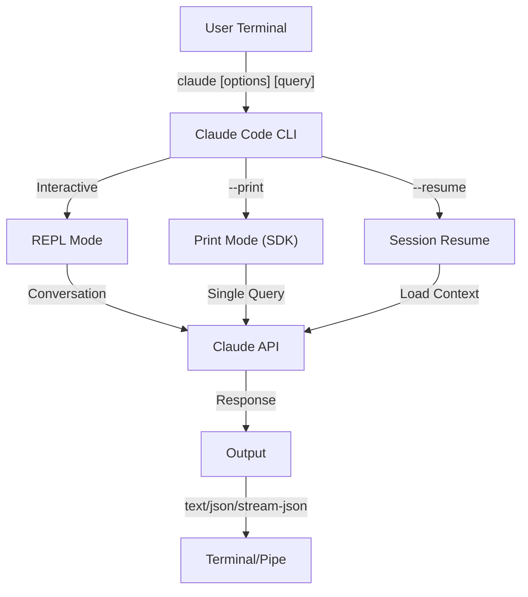
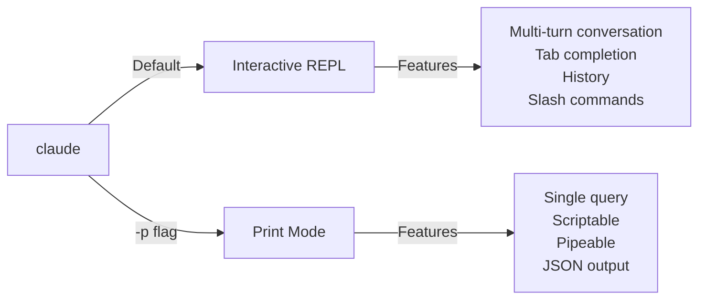

<picture>
<source media="(prefers-color-scheme: dark)" srcset="../resources/logos/claude-howto-logo-dark.svg">
  
</picture>

# CLI 参考

## 概述

Claude Code CLI（命令行界面）是与 Claude Code 交互的主要方式。它提供了强大的选项，用于运行查询、管理会话、配置模型以及将 Claude 集成到您的开发工作流程中。

## 架构



## CLI 命令

|命令|描述 |示例|
|---------|-------------|---------|
| `claude` |启动交互式 REPL | `claude` |
| `claude "query"` |使用初始提示启动 REPL | `claude "explain this project"` |
| `claude -p "query"` |打印模式 - 查询后退出| `claude -p "explain this function"` |
| `cat file \| claude -p "query"` |处理管道内容 | `cat logs.txt \| claude -p "explain"` |
| `claude -c` |继续最近的对话 | `claude -c` |
| `claude -c -p "query"` |继续打印模式 | `claude -c -p "check for type errors"` |
| `claude -r "<session>" "query"` |按 ID 或名称恢复会话 | `claude -r "auth-refactor" "finish this PR"` |
| `claude update` |更新至最新版本 | `claude update` |
| `claude mcp` |配置 MCP 服务器 |请参阅 [MCP 文档](../05-mcp/) |
| `claude mcp serve` |将 Claude Code 作为 MCP 服务器运行 | `claude mcp serve` |
| `claude agents` |列出所有已配置的子代理 | `claude agents` |
| `claude auto-mode defaults` |将自动模式默认规则打印为 JSON | `claude auto-mode defaults` |
| `claude remote-control` |启动远程控制服务器 | `claude remote-control` |
| `claude plugin` |管理插件（安装、启用、禁用）| `claude plugin install my-plugin` |
| `claude auth login` |登录（支持`--email`、`--sso`）| `claude auth login --email user@example.com` |
| `claude auth logout` |退出当前帐户 | `claude auth logout` |
| `claude auth status` |检查身份验证状态（如果已登录则退出 0，如果未登录则退出 1）| `claude auth status` |

## 核心标志

|标志|描述 |示例|
|------|-------------|---------|
| `-p, --print` |无交互模式打印响应 | `claude -p "query"` |
| `-c, --continue` |加载最近的对话 | `claude --continue` |
| `-r, --resume` |按 ID 或名称恢复特定会话 | `claude --resume auth-refactor` |
| `-v, --version` |输出版本号| `claude -v` |
| `-w, --worktree` |从隔离的 git 工作树开始 | `claude -w` |
| `-n, --name` |会话显示名称 | `claude -n "auth-refactor"` |
| `--from-pr <number>` |恢复链接到 GitHub PR 的会话 | `claude --from-pr 42` |
| `--remote "task"` |在 claude.ai 上创建网页会话 | `claude --remote "implement API"` |
| `--remote-control, --rc` |与远程控制的互动会话| `claude --rc` |
| `--teleport` |在本地恢复网页会话 | `claude --teleport` |
| `--teammate-mode` |代理团队显示模式| `claude --teammate-mode tmux` |
| `--bare` |最小模式（跳过钩子、技能、插件、MCP、自动记忆、CLAUDE.md）| `claude --bare` |
| `--enable-auto-mode` |解锁自动权限模式 | `claude --enable-auto-mode` |
| `--channels` |订阅 MCP 消息通道插件 | `claude --channels discord,telegram` |
| `--chrome` / `--no-chrome` |启用/禁用 Chrome 浏览器集成 | `claude --chrome` |
| `--effort` |设定思考努力级别| `claude --effort high` |
| `--init` / `--init-only` |运行初始化挂钩 | `claude --init` |
| `--maintenance` |运行维护挂钩并退出 | `claude --maintenance` |
| `--disable-slash-commands` |禁用所有技能和斜线命令 | `claude --disable-slash-commands` |
| `--no-session-persistence` |禁用会话保存（打印模式）| `claude -p --no-session-persistence "query"` |

### 交互模式与打印模式



交互模式（默认）：
```bash
# Start interactive session
claude

# Start with initial prompt
claude "explain the authentication flow"
```

打印模式（非交互式）：
```bash
# Single query, then exit
claude -p "what does this function do?"

# Process file content
cat error.log | claude -p "explain this error"

# Chain with other tools
claude -p "list todos" | grep "URGENT"
```

## 模型与配置

|标志|描述 |示例|
|------|-------------|---------|
| `--model` |集模型（十四行诗、作品、俳句或全名）| `claude --model opus` |
| `--fallback-model` |过载时自动模型回退 | `claude -p --fallback-model sonnet "query"` |
| `--agent` |指定会话代理 | `claude --agent my-custom-agent` |
| `--agents` |通过 JSON 定义自定义子代理 |请参阅[代理配置](#agents-configuration) |
| `--effort` |设置努力级别（低、中、高、最大）| `claude --effort high` |

### 模型选择示例

```bash
# Use Opus 4.6 for complex tasks
claude --model opus "design a caching strategy"

# Use Haiku 4.5 for quick tasks
claude --model haiku -p "format this JSON"

# Full model name
claude --model claude-sonnet-4-6-20250929 "review this code"

# With fallback for reliability
claude -p --model opus --fallback-model sonnet "analyze architecture"

# Use opusplan (Opus plans, Sonnet executes)
claude --model opusplan "design and implement the caching layer"
```

## 系统提示定制

|标志|描述 |示例|
|------|-------------|---------|
| `--system-prompt` |替换整个默认提示 | `claude --system-prompt "You are a Python expert"` |
| `--system-prompt-file` |从文件加载提示（打印模式） | `claude -p --system-prompt-file ./prompt.txt "query"` |
| `--append-system-prompt` |附加到默认提示 | `claude --append-system-prompt "Always use TypeScript"` |

### 系统提示示例

```bash
# Complete custom persona
claude --system-prompt "You are a senior security engineer. Focus on vulnerabilities."

# Append specific instructions
claude --append-system-prompt "Always include unit tests with code examples"

# Load complex prompt from file
claude -p --system-prompt-file ./prompts/code-reviewer.txt "review main.py"
```

### 系统提示标志比较

|标志|行为 |互动|打印 |
|------|----------|-------------|--------|
| `--system-prompt` |替换整个默认系统提示符 | ✅ | ✅ |
| `--system-prompt-file` |替换为文件 | 中的提示❌ | ✅ |
| `--append-system-prompt` |附加到默认系统提示符 | ✅ | ✅ |

仅在打印模式下使用 `--system-prompt-file`。对于交互模式，请使用 `--system-prompt` 或 `--append-system-prompt`。

## 工具和权限管理

|标志|描述 |示例|
|------|-------------|---------|
| `--tools` |限制可用的内置工具 | `claude -p --tools "Bash,Edit,Read" "query"` |
| `--allowedTools` |无需提示即可执行的工具 | `"Bash(git log:*)" "Read"` |
| `--disallowedTools` |从上下文中删除的工具 | `"Bash(rm:*)" "Edit"` |
| `--dangerously-skip-permissions` |跳过所有权限提示 | `claude --dangerously-skip-permissions` |
| `--permission-mode` |以指定权限模式开始| `claude --permission-mode auto` |
| `--permission-prompt-tool` |用于权限处理的 MCP 工具 | `claude -p --permission-prompt-tool mcp_auth "query"` |
| `--enable-auto-mode` |解锁自动权限模式 | `claude --enable-auto-mode` |

### 权限示例

```bash
# Read-only mode for code review
claude --permission-mode plan "review this codebase"

# Restrict to safe tools only
claude --tools "Read,Grep,Glob" -p "find all TODO comments"

# Allow specific git commands without prompts
claude --allowedTools "Bash(git status:*)" "Bash(git log:*)"

# Block dangerous operations
claude --disallowedTools "Bash(rm -rf:*)" "Bash(git push --force:*)"
```

## 输出和格式

|标志|描述 |选项|示例|
|------|-------------|---------|---------|
| `--output-format` |指定输出格式（打印模式） | `text`、`json`、`stream-json` | `claude -p --output-format json "query"` |
| `--input-format` |指定输入格式（打印模式） | `text`、`stream-json` | `claude -p --input-format stream-json` |
| `--verbose` |启用详细日志记录 | | `claude --verbose` |
| `--include-partial-messages` |包括流媒体事件 |需要 `stream-json` | `claude -p --output-format stream-json --include-partial-messages "query"` |
| `--json-schema` |获取经过验证的 JSON 匹配架构 | | `claude -p --json-schema '{"type":"object"}' "query"` |
| `--max-budget-usd` |打印模式的最大支出| | `claude -p --max-budget-usd 5.00 "query"` |

### 输出格式示例

```bash
# Plain text (default)
claude -p "explain this code"

# JSON for programmatic use
claude -p --output-format json "list all functions in main.py"

# Streaming JSON for real-time processing
claude -p --output-format stream-json "generate a long report"

# Structured output with schema validation
claude -p --json-schema '{"type":"object","properties":{"bugs":{"type":"array"}}}' \
  "find bugs in this code and return as JSON"
```

## 工作区和目录

|标志|描述 |示例|
|------|-------------|---------|
| `--add-dir` |添加额外的工作目录 | `claude --add-dir ../apps ../lib` |
| `--setting-sources` |逗号分隔的设置源 | `claude --setting-sources user,project` |
| `--settings` |从文件或 JSON 加载设置 | `claude --settings ./settings.json` |
| `--plugin-dir` |从目录加载插件（可重复）| `claude --plugin-dir ./my-plugin` |

### 多目录示例

```bash
# Work across multiple project directories
claude --add-dir ../frontend ../backend ../shared "find all API endpoints"

# Load custom settings
claude --settings '{"model":"opus","verbose":true}' "complex task"
```

## MCP 配置

|标志|描述 |示例|
|------|-------------|---------|
| `--mcp-config` |从 JSON 加载 MCP 服务器 | `claude --mcp-config ./mcp.json` |
| `--strict-mcp-config` |仅使用指定的 MCP 配置 | `claude --strict-mcp-config --mcp-config ./mcp.json` |
| `--channels` |订阅 MCP 消息通道插件 | `claude --channels discord,telegram` |

### MCP 示例

```bash
# Load GitHub MCP server
claude --mcp-config ./github-mcp.json "list open PRs"

# Strict mode - only specified servers
claude --strict-mcp-config --mcp-config ./production-mcp.json "deploy to staging"
```

## 会话管理

|标志|描述 |示例|
|------|-------------|---------|
| `--session-id` |使用特定会话 ID (UUID) | `claude --session-id "550e8400-..."` |
| `--fork-session` |恢复时创建新会话 | `claude --resume abc123 --fork-session` |

### 会话示例

```bash
# Continue last conversation
claude -c

# Resume named session
claude -r "feature-auth" "continue implementing login"

# Fork session for experimentation
claude --resume feature-auth --fork-session "try alternative approach"

# Use specific session ID
claude --session-id "550e8400-e29b-41d4-a716-446655440000" "continue"
```

### 会话分叉

从现有会话创建一个分支以进行实验：

```bash
# Fork a session to try a different approach
claude --resume abc123 --fork-session "try alternative implementation"

# Fork with a custom message
claude -r "feature-auth" --fork-session "test with different architecture"
```

使用案例：
- 尝试替代实现而不丢失原始会话
- 并行试验不同的方法
- 从成功的工作中创建分支以获得变化
- 在不影响主会话的情况下测试重大更改

原来的会话保持不变，分叉成为新的独立会话。

## 高级功能

|标志|描述 |示例|
|------|-------------|---------|
| `--chrome` |启用 Chrome 浏览器集成 | `claude --chrome` |
| `--no-chrome` |禁用 Chrome 浏览器集成 | `claude --no-chrome` |
| `--ide` |自动连接到 IDE（如果可用）| `claude --ide` |
| `--max-turns` |限制代理轮次（非交互式）| `claude -p --max-turns 3 "query"` |
| `--debug` |启用带有过滤的调试模式 | `claude --debug "api,mcp"` |
| `--enable-lsp-logging` |启用详细 LSP 日志记录 | `claude --enable-lsp-logging` |
| `--betas` | API 请求的 Beta 标头 | `claude --betas interleaved-thinking` |
| `--plugin-dir` |从目录加载插件（可重复）| `claude --plugin-dir ./my-plugin` |
| `--enable-auto-mode` |解锁自动权限模式 | `claude --enable-auto-mode` |
| `--effort` |设定思考努力级别| `claude --effort high` |
| `--bare` |最小模式（跳过钩子、技能、插件、MCP、自动记忆、CLAUDE.md）| `claude --bare` |
| `--channels` |订阅 MCP 消息通道插件 | `claude --channels discord` |
| `--fork-session` |恢复时创建新的会话 ID | `claude --resume abc --fork-session` |
| `--max-budget-usd` |最大支出（打印模式）| `claude -p --max-budget-usd 5.00 "query"` |
| `--json-schema` |已验证的 JSON 输出 | `claude -p --json-schema '{"type":"object"}' "q"` |

### 高级示例

```bash
# Limit autonomous actions
claude -p --max-turns 5 "refactor this module"

# Debug API calls
claude --debug "api" "test query"

# Enable IDE integration
claude --ide "help me with this file"
```

## 代理配置

`--agents` 标志接受为会话定义自定义子代理的 JSON 对象。

### 代理 JSON 格式

```json
{
  "agent-name": {
    "description": "Required: when to invoke this agent",
    "prompt": "Required: system prompt for the agent",
    "tools": ["Optional", "array", "of", "tools"],
    "model": "optional: sonnet|opus|haiku"
  }
}
```

必填字段：
- `description` - 何时使用此代理的自然语言描述
- `prompt` - 定义座席角色和行为的系统提示

可选字段：
- `tools` - 可用工具数组（如果省略则继承所有工具）
  - 格式：`["Read", "Grep", "Glob", "Bash"]`
- `model` - 要使用的模型：`sonnet`、`opus` 或 `haiku`

### 完整的代理示例

```json
{
  "code-reviewer": {
    "description": "Expert code reviewer. Use proactively after code changes.",
    "prompt": "You are a senior code reviewer. Focus on code quality, security, and best practices.",
    "tools": ["Read", "Grep", "Glob", "Bash"],
    "model": "sonnet"
  },
  "debugger": {
    "description": "Debugging specialist for errors and test failures.",
    "prompt": "You are an expert debugger. Analyze errors, identify root causes, and provide fixes.",
    "tools": ["Read", "Edit", "Bash", "Grep"],
    "model": "opus"
  },
  "documenter": {
    "description": "Documentation specialist for generating guides.",
    "prompt": "You are a technical writer. Create clear, comprehensive documentation.",
    "tools": ["Read", "Write"],
    "model": "haiku"
  }
}
```

### 代理命令示例

```bash
# Define custom agents inline
claude --agents '{
  "security-auditor": {
    "description": "Security specialist for vulnerability analysis",
    "prompt": "You are a security expert. Find vulnerabilities and suggest fixes.",
    "tools": ["Read", "Grep", "Glob"],
    "model": "opus"
  }
}' "audit this codebase for security issues"

# Load agents from file
claude --agents "$(cat ~/.claude/agents.json)" "review the auth module"

# Combine with other flags
claude -p --agents "$(cat agents.json)" --model sonnet "analyze performance"
```

### 代理优先

当存在多个代理定义时，它们按以下优先顺序加载：
1. CLI 定义（`--agents` 标志）- 特定于会话
2. 用户级 (`~/.claude/agents/`) - 所有项目
3. 项目级 (`.claude/agents/`) - 当前项目

CLI 定义的代理会覆盖会话的用户代理和项目代理。

---

## 高价值用例

### 1. CI/CD 集成

在 CI/CD 管道中使用 Claude Code 进行自动代码审查、测试和文档记录。

GitHub Actions示例：

```yaml
name: AI Code Review

on: [pull_request]

jobs:
  review:
    runs-on: ubuntu-latest
    steps:
      - uses: actions/checkout@v4

      - name: Install Claude Code
        run: npm install -g @anthropic-ai/claude-code

      - name: Run Code Review
        env:
          ANTHROPIC_API_KEY: ${{ secrets.ANTHROPIC_API_KEY }}
        run: |
          claude -p --output-format json \
            --max-turns 1 \
            "Review the changes in this PR for:
            - Security vulnerabilities
            - Performance issues
            - Code quality
            Output as JSON with 'issues' array" > review.json

      - name: Post Review Comment
        uses: actions/github-script@v7
        with:
          script: |
            const fs = require('fs');
            const review = JSON.parse(fs.readFileSync('review.json', 'utf8'));
            // Process and post review comments
```

詹金斯管道：

```groovy
pipeline {
    agent any
    stages {
        stage('AI Review') {
            steps {
                sh '''
                    claude -p --output-format json \
                      --max-turns 3 \
                      "Analyze test coverage and suggest missing tests" \
                      > coverage-analysis.json
                '''
            }
        }
    }
}
```

### 2. 脚本管道

通过 Claude 处理文件、日志和数据进行分析。

日志分析：

```bash
# Analyze error logs
tail -1000 /var/log/app/error.log | claude -p "summarize these errors and suggest fixes"

# Find patterns in access logs
cat access.log | claude -p "identify suspicious access patterns"

# Analyze git history
git log --oneline -50 | claude -p "summarize recent development activity"
```

代码处理：

```bash
# Review a specific file
cat src/auth.ts | claude -p "review this authentication code for security issues"

# Generate documentation
cat src/api/*.ts | claude -p "generate API documentation in markdown"

# Find TODOs and prioritize
grep -r "TODO" src/ | claude -p "prioritize these TODOs by importance"
```

### 3. 多会话工作流程

通过多个对话线程管理复杂的项目。

```bash
# Start a feature branch session
claude -r "feature-auth" "let's implement user authentication"

# Later, continue the session
claude -r "feature-auth" "add password reset functionality"

# Fork to try an alternative approach
claude --resume feature-auth --fork-session "try OAuth instead"

# Switch between different feature sessions
claude -r "feature-payments" "continue with Stripe integration"
```

### 4.自定义代理配置

为您团队的工作流程定义专门的代理。

```bash
# Save agents config to file
cat > ~/.claude/agents.json << 'EOF'
{
  "reviewer": {
    "description": "Code reviewer for PR reviews",
    "prompt": "Review code for quality, security, and maintainability.",
    "model": "opus"
  },
  "documenter": {
    "description": "Documentation specialist",
    "prompt": "Generate clear, comprehensive documentation.",
    "model": "sonnet"
  },
  "refactorer": {
    "description": "Code refactoring expert",
    "prompt": "Suggest and implement clean code refactoring.",
    "tools": ["Read", "Edit", "Glob"]
  }
}
EOF

# Use agents in session
claude --agents "$(cat ~/.claude/agents.json)" "review the auth module"
```

### 5. 批处理

使用一致的设置处理多个查询。

```bash
# Process multiple files
for file in src/*.ts; do
  echo "Processing $file..."
  claude -p --model haiku "summarize this file: $(cat $file)" >> summaries.md
done

# Batch code review
find src -name "*.py" -exec sh -c '
  echo "## $1" >> review.md
  cat "$1" | claude -p "brief code review" >> review.md
' _ {} \;

# Generate tests for all modules
for module in $(ls src/modules/); do
  claude -p "generate unit tests for src/modules/$module" > "tests/$module.test.ts"
done
```

### 6. 安全意识开发

使用权限控制以确保安全操作。

```bash
# Read-only security audit
claude --permission-mode plan \
  --tools "Read,Grep,Glob" \
  "audit this codebase for security vulnerabilities"

# Block dangerous commands
claude --disallowedTools "Bash(rm:*)" "Bash(curl:*)" "Bash(wget:*)" \
  "help me clean up this project"

# Restricted automation
claude -p --max-turns 2 \
  --allowedTools "Read" "Glob" \
  "find all hardcoded credentials"
```

### 7. JSON API 集成

使用 Claude 作为带有 `jq` 解析的工具的可编程 API。

```bash
# Get structured analysis
claude -p --output-format json \
  --json-schema '{"type":"object","properties":{"functions":{"type":"array"},"complexity":{"type":"string"}}}' \
  "analyze main.py and return function list with complexity rating"

# Integrate with jq for processing
claude -p --output-format json "list all API endpoints" | jq '.endpoints[]'

# Use in scripts
RESULT=$(claude -p --output-format json "is this code secure? answer with {secure: boolean, issues: []}" < code.py)
if echo "$RESULT" | jq -e '.secure == false' > /dev/null; then
  echo "Security issues found!"
  echo "$RESULT" | jq '.issues[]'
fi
```

### jq 解析示例

使用 `jq` 解析和处理 Claude 的 JSON 输出：

```bash
# Extract specific fields
claude -p --output-format json "analyze this code" | jq '.result'

# Filter array elements
claude -p --output-format json "list issues" | jq -r '.issues[] | select(.severity=="high")'

# Extract multiple fields
claude -p --output-format json "describe the project" | jq -r '.{name, version, description}'

# Convert to CSV
claude -p --output-format json "list functions" | jq -r '.functions[] | [.name, .lineCount] | @csv'

# Conditional processing
claude -p --output-format json "check security" | jq 'if .vulnerabilities | length > 0 then "UNSAFE" else "SAFE" end'

# Extract nested values
claude -p --output-format json "analyze performance" | jq '.metrics.cpu.usage'

# Process entire array
claude -p --output-format json "find todos" | jq '.todos | length'

# Transform output
claude -p --output-format json "list improvements" | jq 'map({title: .title, priority: .priority})'
```

---

## 模型

Claude Code 支持具有不同功能的多种模型：

|模型|模型 ID |上下文窗口 |笔记|
|--------|-----|----------------|--------|
|Opus 4.6 | `claude-opus-4-6` | 100 万个代币 |最有能力、适应性强的努力级别 |
|Sonnet 4.6 | `claude-sonnet-4-6` | 100 万个代币 |平衡的速度和能力|
|Haiku 4.5 | `claude-haiku-4-5` | 100 万个代币 |最快，最适合快速任务 |

### 模型选择

```bash
# Use short names
claude --model opus "complex architectural review"
claude --model sonnet "implement this feature"
claude --model haiku -p "format this JSON"

# Use opusplan alias (Opus plans, Sonnet executes)
claude --model opusplan "design and implement the API"

# Toggle fast mode during session
/fast
```

### 努力级别（Opus 4.6）

Opus 4.6 支持自适应推理的工作量级别：

```bash
# Set effort level via CLI flag
claude --effort high "complex review"

# Set effort level via slash command
/effort high

# Set effort level via environment variable
export CLAUDE_CODE_EFFORT_LEVEL=high   # low, medium, high, or max (Opus 4.6 only)
```

提示中的"ultrathink"关键字可以激活深度推理。 `max` 努力级别是 Opus 4.6 独有的。

---

## 关键环境变量

|变量|描述 |
|----------|-------------|
| `ANTHROPIC_API_KEY` |用于身份验证的 API 密钥 |
| `ANTHROPIC_MODEL` |覆盖默认模型 |
| `ANTHROPIC_CUSTOM_MODEL_OPTION` | API 的自定义模型选项 |
| `ANTHROPIC_DEFAULT_OPUS_MODEL` |覆盖默认 Opus 模型 ID |
| `ANTHROPIC_DEFAULT_SONNET_MODEL` |覆盖默认 Sonnet 模型 ID |
| `ANTHROPIC_DEFAULT_HAIKU_MODEL` |覆盖默认俳句模型 ID |
| `MAX_THINKING_TOKENS` |设置扩展思维代币预算 |
| `CLAUDE_CODE_EFFORT_LEVEL` |设置努力级别 (`low`/`medium`/`high`/`max`) |
| `CLAUDE_CODE_SIMPLE` |最小模式，由 `--bare` 标志设置 |
| `CLAUDE_CODE_DISABLE_AUTO_MEMORY` |禁用自动 CLAUDE.md 更新 |
| `CLAUDE_CODE_DISABLE_BACKGROUND_TASKS` |禁用后台任务执行 |
| `CLAUDE_CODE_DISABLE_CRON` |禁用计划/cron 任务 |
| `CLAUDE_CODE_DISABLE_GIT_INSTRUCTIONS` |禁用git相关指令 |
| `CLAUDE_CODE_DISABLE_TERMINAL_TITLE` |禁用终端标题更新 |
| `CLAUDE_CODE_DISABLE_1M_CONTEXT` |禁用 1M 令牌上下文窗口 |
| `CLAUDE_CODE_DISABLE_NONSTREAMING_FALLBACK` |禁用非流回退 |
| `CLAUDE_CODE_ENABLE_TASKS` |启用任务列表功能 |
| `CLAUDE_CODE_TASK_LIST_ID` |跨会话共享的命名任务目录 |
| `CLAUDE_CODE_ENABLE_PROMPT_SUGGESTION` |切换提示建议 (`true`/`false`) |
| `CLAUDE_CODE_EXPERIMENTAL_AGENT_TEAMS` |启用实验代理团队 |
| `CLAUDE_CODE_NEW_INIT` |使用新的初始化流程 |
| `CLAUDE_CODE_SUBAGENT_MODEL` |子代理执行模型 |
| `CLAUDE_CODE_PLUGIN_SEED_DIR` |插件种子文件目录 |
| `CLAUDE_CODE_SUBPROCESS_ENV_SCRUB` |从子进程中清除的环境变量 |
| `CLAUDE_AUTOCOMPACT_PCT_OVERRIDE` |覆盖自动压缩百分比 |
| `CLAUDE_STREAM_IDLE_TIMEOUT_MS` |流空闲超时（以毫秒为单位）|
| `SLASH_COMMAND_TOOL_CHAR_BUDGET` |斜线命令工具的字符预算|
| `ENABLE_TOOL_SEARCH` |启用工具搜索功能 |
| `MAX_MCP_OUTPUT_TOKENS` | MCP 工具输出的最大令牌 |

---

## 快速参考

### 最常用命令

```bash
# Interactive session
claude

# Quick question
claude -p "how do I..."

# Continue conversation
claude -c

# Process a file
cat file.py | claude -p "review this"

# JSON output for scripts
claude -p --output-format json "query"
```

### 标志组合

|使用案例|命令|
|----------|---------|
|快速代码审查 | `cat file | claude -p "review"` |
|结构化输出| `claude -p --output-format json "query"` |
|安全勘探| `claude --permission-mode plan` |
|安全自主 | `claude --enable-auto-mode --permission-mode auto` |
| CI/CD 集成 | `claude -p --max-turns 3 --output-format json` |
|恢复工作 | `claude -r "session-name"` |
|定制模型 | `claude --model opus "complex task"` |
|最小模式 | `claude --bare "quick query"` |
|预算上限运行 | `claude -p --max-budget-usd 2.00 "analyze code"` |

---

## 故障排除

### 未找到命令

问题：`claude: command not found`

解决方案：
- 安装Claude Code：`npm install -g @anthropic-ai/claude-code`
- 检查 PATH 包括 npm 全局 bin 目录
- 尝试使用完整路径运行：`npx claude`

### API 密钥问题

问题：身份验证失败

解决方案：
- 设置 API 密钥：`export ANTHROPIC_API_KEY=your-key`
- 检查密钥是否有效且有足够的积分
- 验证所请求模型的关键权限

### 未找到会话

问题：无法恢复会话

解决方案：
- 列出可用会话以查找正确的名称/ID
- 会话可能会在不活动一段时间后过期
- 使用 `-c` 继续最近的会话

### 输出格式问题

问题：JSON 输出格式错误

解决方案：
- 使用 `--json-schema` 强制结构
- 在提示中添加明确的 JSON 指令
- 使用 `--output-format json` （不仅仅是在提示中要求 JSON）

### 没有权限

问题：工具执行被阻止

解决方案：
- 检查 `--permission-mode` 设置
- 查看 `--allowedTools` 和 `--disallowedTools` 标志
- 使用 `--dangerously-skip-permissions` 进行自动化（谨慎）

---

## 其他资源

- [官方 CLI 参考](https://code.claude.com/docs/en/CLI-reference) - 完整命令参考
- [无头模式文档](https://code.claude.com/docs/en/headless) - 自动执行
- [斜杠命令](../01-slash-commands/) - Claude 中的自定义快捷键
- [内存指南](../02-memory/) - 通过 CLAUDE.md 持久上下文
- [MCP 协议](../05-mcp/) - 外部工具集成
- [高级功能](../09-advanced-features/) - 规划模式，延伸思维
- [子代理指南](../04-subagents/) - 委派任务执行

---

*[Claude How To](../) 指南系列的一部分*

